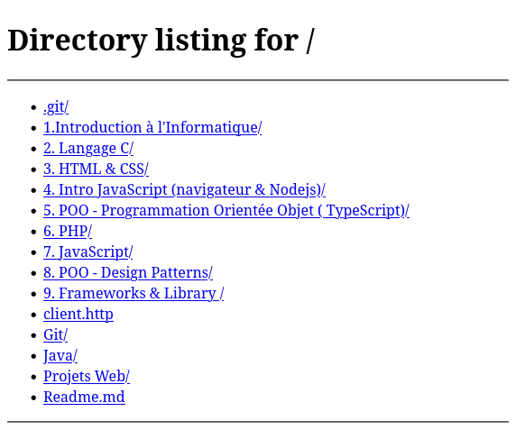

# Projet SSR - List File

L'objectif de ce projet est de créer un serveur HTTP qui affiche le contenu d'un dossier. 

Ce serveur n'aura donc pas pour objectif d'afficher un site web à proprement parlé.

Pour vous aider à comprendre le besoin, l'objectif est de reproduire le comportement de cette commande Python.

```bash
python3 -m http.server
```

Je lance cette commande Python à la racine du dossier parcours-dwwm par exemple, Je dois pouvoir naviguer et parcourir les fichiers.



## Cahier des charges

|Taches|Description|Contraintes|
|-|-|-|
|List file| Faite un serveur HTTP qui affche le contenu du dossier courant sous la forme d'une liste à point de fichiers.|Utilisez les balise `<ul>` `<li>`.|
| Le rendu doit etre fait entièrement coté serveur| Aucun JavaScript front-end n'est autoriser|
|Bonus (navigation) | A l'aide d'une balise `<a href>` et de `req.url` permettez à l'utilisateur de naviguer de dossier en dossier.|
| Bonus (readFile)| En plus de la navigation il doit etre possible de visualiser le contenu d'un fichier | Attention à bien définir le content-type grâce à l'extension https://www.npmjs.com/package/mime-types|

## Objectif pédagogique

Le but de projet est de vous faire comprendre ce qu'est le rendu côté serveur, c'est à dire le fait qu'un serveur HTTP n'affiche pas simplement un fichier mais affiche du contenu dynamique en fonction de l'url qu'on lui demande, on lui donne.

C'est là l'objectif initial du langage de programmation PHP qui permet de fabriquer du HTML de façon dynamique côté serveur.

Je vous demande bien sûr, pas de recoder l'entièreté du programme du langage PHP mais seulement de pouvoir afficher dynamiquement des dossiers et leurs contenus en fonction d'une URL.