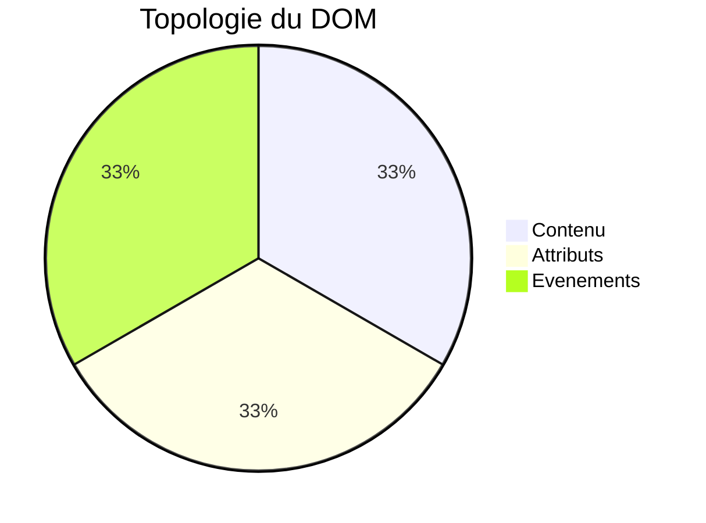
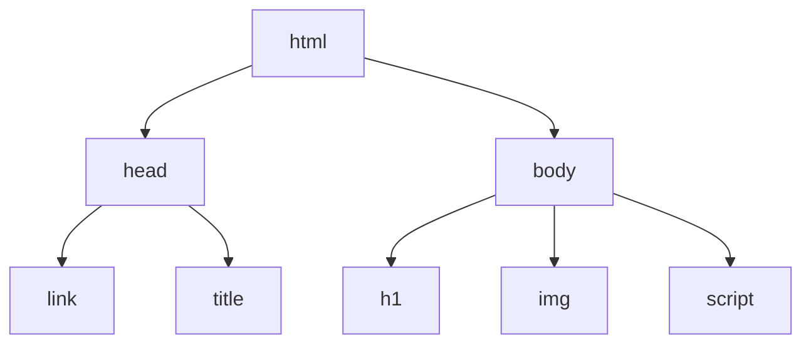
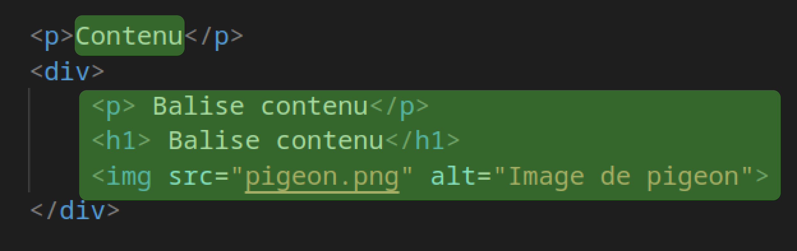

# La topologie du DOM
L'utilisation du DOM peut être divisé en 3 parties : le contenu, les attributs, les évenements.
Lorsque je veux utiliser le DOM je me pose toujours la question de : "A quoi est ce que je veux accéder ? : le contenu d'une balise, les attributs d'une balise ou les évenements d'une balise ?".

Le DOM est un arbre composé de branche, au bout de chaque branche se trouve un noeud. Le premier noeud est la balise `<html>` qui contient toute les autre balises.

## Le Contenu : le texte interne ou une balise fille
C'est le contenu d'une balise qui peut être soit un texte soit une balise fille.

```html
<p>Texte interne du paragraphe.</p>
<a href="http://youtube.com">Texte interne d'un lien</a>
<h1>Texte interne d'un titre</h1>
```
*Contenu : texte interne d'une balise.*
```html
<div>
    <p>AirMax taille 42</p> // Balise fille du div
     // Balise fille du div
</div>
```
*Contenu : balises filles d'une balise.*

Le contenu d'une balise peut être un texte ou d'autres balises filles.
Grâce à la partie *contenu* du DOM vous pourrez : changer le texte, **récuperer** des balises (querySelector), les **supprimer**(remove) ou même en **ajouter** de nouvelles(appendChild).
>Cela peut paraitre bête mais le contenu d'un balise est forcement soit un texte soit d'autres balises, ainsi est fait le HTML.

## Les Attributs HTML
Les attributs HTML son accessibles et modifiables grâce au DOM.
Parmis les attributs les plus classique on retrouve : `href`, `src` ou encore `class`.
```html
<balise attributHTML="Exemple d'attribut HTML">Un balise HTML</balise>

<a href="lienClicable"> Go to youtube.</a>
```
On accède au attributs pour deux raisons : la **lecture** (getAttribute) ou la **modification**(setAttribute).

Par exemple :
- Je veux **modifier** l'attribut `src` d'une image
- Je veux connaitre le lien d'un texte en **lisant** l'attribut `href`.
- Je veux ajouter un classe CSS en `modifiant` l'attribut `class`.

## Les événements
Le principale avantage du JavaScript est la facilité avec laquelle on peut réagir à des évenements. **Un évenement est une action de l'utilisateur auquelle on peut associer une fonction.**
Parmis les évenements les plus connus on retrouve :
- "click" : L'utilisateur a cliqué
- "dblclick" : L'utilisateur a double cliqué
- "scroll" : l'utilisateur a scrollé
- "change" : l'utilisateur a écrit un caractère dans une balise input
- "input" : l'utilisateur a appuyé sur ENTREE dans une balise input
- "submit" : l'utilisateur a soumit un forumlaire
- "copy" / "paste" : l'utilisateur a copié (Ctrl+C) ou collé (Ctrl+V).

```html

```
En HTML on peut executer du JavaScript lors d'un evenement grâce à l'attribut HTML `onclick`, cette méthode propose peu de flexibilité et ne permet pas de séparer le JS du HTML. ***Je déconseille donc son utilisation.***

