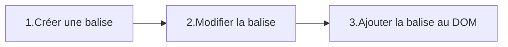

## Le contenu
Comme dit précedement le contenu d'une balise peut être un texte ou bien d'autre balise. Commençont par voir comment récupérer une balise dans le `document` ou dans une autre balise.
### `querySelector` - récupérer une balise
La méthode querySelector est disponible sur les objets des classes `Element` et `Document`.
#### Valeur de retour
Un objet `Element` du `document` ou `null` si l'element demandé n'existe pas.
#### Paramètre
Une `string` contenant un selecteur CSS valide.
```html
<h1>Titre</h1>
<p id="paragraphe">texte un peu long.</p>

<div>
    <h1>Air Max 42</h1>
    
</div>
```

#### Selectionner une balise via le nom de la balise
```js
const titre =  document.querySelector("h1");
```
#### Selectionner une balise via son id
```js
const para =  document.querySelector("#paragraphe");
```
#### Selectionner une balise via sa classe 
```js
const oiseau =  document.querySelector(".photo");
```
#### Selectionner une balise via un selecteur CSS complexe
```js
const shoesImg =  document.querySelector("div>.photo");
```

> --- 
> `querySelector` renvoi le premier `Element` rencontré qui match le selecteur CSS, voilà pourquoi le code suivant renvoi l'`` de l'oiseau et non de la chaussure.
>```js 
>const oiseau =  document.querySelector(".photo"); //=> 
>```
>---

#### `querySelector` sur un `Element`
Je peux effectuer un `querySelector` sur un `Element` récuperée avec `document.querySelector`. Ceci permet de rechercher uniquement les balises correspondants au selecteur CSS dans le **contenu** de la balise et non dans tout le document.
```js
const conteneur = document.querySelector("div"); // => <div>...</div>
const shoesName = conteneur.querySelector("h1");  // => <h1>Air Max 42</h1>
```

### `innerText` - Le contenu textuel
`innerText` est un attiribut de la classe Node. Il permet de lire ou modifier le texte écrit entre la balise ouvrante et la balise fermante de n'importe quelle balise HTML non-orpheline.
#### Lire le contenu textuel d'une balise
On lit le contenu via l'attribut `innerText`.
```html
<p id="paragraphe">texte pas très long</p>
```
```js
const para =  document.querySelector("#paragraphe");
console.log(para.innerText);        // => "texte pas très long"
```

#### Modifier le contenu textuel d'une balise.
On modifie le contenu textuel en affectant une nouvelle valeur à l'attribut `innerText` comme pour n'importe quelle variable.
```html
<p id="paragraphe">texte pas très long</p>
```
```js
const para =  document.querySelector("#paragraphe");
console.log(para.innerText);        // => "texte pas très long"
para.innerText = "Nouveau texte pour mon paragraphe";
console.log(para.innerText);        // => "Nouveau texte pour mon paragraphe"
```

### Créer dynamiquement une balise enfant
L'ajout d'une nouvelle balise dans le HTML se fait en plusieurs étapes.

#### `createElement` - Créer une balise
```html
<body>
</body>
```
```js
const nouvelleBalise = document.createElement("p");
```
##### Valeur de retour
Un objet de la classe `Element` similaire à ceux renvoyés par `querySelector`.
##### Paramètre
Le nom de la balise - une `string` contenant le nom de la balise à créer comme : `"h1"`, `"h2"`, `"div"`, `"a"`, `"img"`.
#### Modifier la balise
L'étape de modification permet de définir le texte de la balise, d'éventuel attributs(class, src, href,...) ou d'y attacher des évenements. Elle n'est pas obligatoire mais est dans la plupart des cas présente.
```js
nouvelleBalise.innerText = "Ceci est une balise crée dynamiquement en JavaScript"
```
*Modification du texte interne d'une balise crée au péalable.*

> La modification d'une balise ne consiste pas uniquement en la modification de son texte. la plupart du temps on voudra également modifier ses attributs et parfois y attacher des évenements.

#### `appendChild` - Ajouter la balise au document
La méthode `appendChild` permet d'ajouter une balise crée avec `createElement` dans une autre balise, et ainsi le rendre visible sur la page html.

```js
document.body.appendChild(nouvelleBalise);
```
*Résultat*
```html
<body>
    <p>Ceci est une balise crée dynamiquement en JavaScript</p>
</body>
```
Si l'on appel `appendChild` à partir de l'objet `document` la nouvelle balise sera rajoutée à la fin du `<body>`.

#### `appendChild` - Ajouter une balise dans une balise
Il est également possible d'ajouter une balise dans une balise autre que `<body>` en effectuant un `querySelector` au préalable.
```html
<body>
    <h1>Ma page</h1>
    <div class="container">
        <p>J'etais là avant !</p>
    </div>
</body>
```
```js
const nouvelleBalise = document.createElement("p");
nouvelleBalise.innerText = "Je suis une balise p dans un div.";
const conteneur = document.querySelector(".container");
conteneur.appendChild(nouvelleBalise);
```
*Résultat*
```html
<body>
    <h1>Ma page</h1>
    <div class="container">
        <p>J'etais là avant !</p>
        <p>Je suis une balise p dans un div.</p>
    </div>
</body>
```
<!-- ### Créer dyanamiquement une balise enfant SANS HTML dans le JavaScript
La balise template permet de cloner une balise HTML existante.

```html
d
```

```js

``` -->


