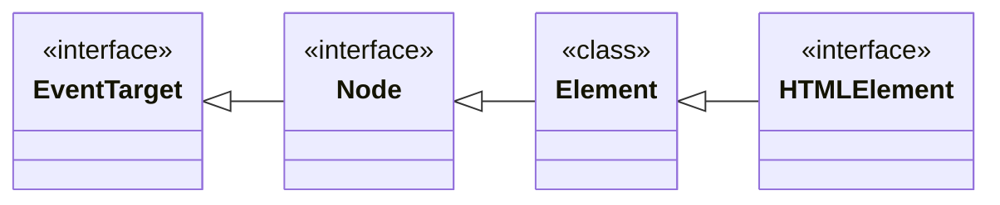
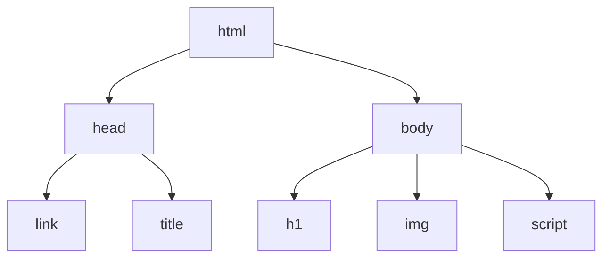

# Les classes et interface du DOM

Le DOM c'est la représentation objet du document HTML et de toutes ses caractéristiques. Comme pour tout objets les elements(les balises) du document sont instanciés à partir de classes.

## La classe Element
La classe `Element` represente tout les elements du DOM. Dans le cadre d'un document HTML il represente les balises. 
La classe `Element` contient la plupart des méthodes et attributs permettant la **manipulation** des elements comme par exemple : 
- `Element`.appendChild() : Ajoute une element
- `Element`.getAttribute() : Recupère les attributs de l'element (src, href, id, class).
- `Element`.setAttribute() : Change la valeur des attributs de l'element.
- `Element`.classList.add() : Ajoute une classe CSS à un element
- `Element`.classList.remove() : Retire une classe CSS à un element

En résumé, la classe `Element` permet d'ajouter ou modifier les caractéristiques ou le contenu des balises peut importe que l'on parle de HTML, XML, SVG ou autre forme de document.
## La classe HTMLElement
La classe HTMlElement est un interface qui fournis des méthodes et attributs permettent, tout comme `Element`, de manipuler les balises a la différence que HTMLElement est spécialiser dans les balises HTML : 
- innerText : Contenu textuel d'une balise, comme le texte d'un `
`.
- style : les propriétés CSS de l'element, comme style.backgroundColor.

Tout les `HTMLElement` hérite de la classe `Element`.
En résumé : la classe `HTMLElement` permet d'ajouter ou modifier les caractéristiques ou le contenu des balises HTML exclusivement.

## La classe Node
La classe Node est un interface qui représente toutes les parties d'un document et pas seulement les balises; il represente, par exemple, également les commentaires HTML.

Un document est un "arbre génalogiques" d'element appelé noeud. Tout `Element` est également un noeud. Un noeud peut accéder à ses élements enfants ou frères via les méthodes :

- previousElementSibiling : Node précedent 
- nextElementSibiling : Node suivant 
- firstChild : Premier node d'un node
- lastChild : Dernier node d'un node

Tout les `Element` héritent de la classe `Node` et on donc accès au méthodes et attributs de la classe `Node`.

En résumé la classe `Node` permet d'évoluer entre les noeuds du document, la plupart du temps ces noeuds seront des `HTMLElement` et donc par extensions des `Elements`. 

## La classe EventTarget 
La classe EventTarget est un interface implémenté par tout les `Element` du DOM. Elle permet l'accès au méthodes comme `addEventListener` et `removeEventListener` qui permettent d'associer à un évenement l'éxecution d'une fonction.
Tout `Node` peut être ciblé par un évenement car la classe `Node` hérite de `EventTarget`.
