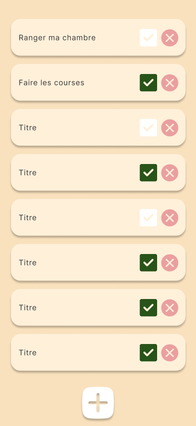
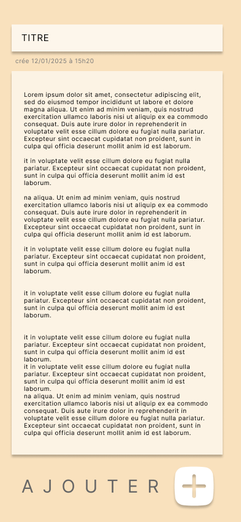

# TODOList Localstorage

Une application web pour lister et suivre les choses à faire.

## Qu'est ce qu'une tâche ?

Une tâche est une chose à faire, elle est contient plusieurs infos

- un titre
- une description 
- une case cochable (checkbox) pour valider la tâche comme faite.
- un bouton (poubelle) pour supprimer une tâche
- un bouton voir plus qui affiche la description dans un menu déroulant.

## Comment ajouter une tâche
Il faut appuier sur le bouton AJOUTER UNE Tache pour ajouter une nouvelle tâche.
## Proposition de maquette

### Lien proto figma intéractif 
https://www.figma.com/proto/e4qUHkuVIG9kX9MaqR6tJW/Untitled?node-id=101-10&t=t8VKEBFTkTtxBZVB-1&scaling=scale-down&content-scaling=fixed&page-id=0%3A1&starting-point-node-id=101%3A10

### Capture d'écrans
#### Accueil

#### Formulaire d'ajout de tâche


## Cahier des charges

|Taches|Description|Cas critique|
|-|-|-|
|Formulaire d'ajout de tâche| Une tâche est faite d'un titre, d'une description, d'une case cochable pour valider la tâche et d'un bouton supprimé et d'une date de création | Les tâches ajoutés doivent être stockées dans le localStorage sous la forme d'un tableau JSON pour permettre aux tâches d'être sauvegarder |
| Afficher les tâches| Afficher toutes les tâches contenu dans le localStorage| Affichage des tâches au chargement de la page et mise à jour des taches quand une tâche est ajoutés|
| Version mobile| La version mobile est prioritaire et doit être faite en premier |
| UX |  - Le formulaire d'ajout apparait en slide in comme dans le proto figma <br> - Le bouton ajouter doit toujours être visible |
| Tache Fini| Si l'utilisateur valide une tache ses changement doivent être répércuté dans le localStorage |
| Barre de recherche | Ajouter une barre de recherche pour afficher uniquement les tâches qui contiennent le texte tapé |
| Trier par date | L'utilisateur doit pouvoir trier dans de la tâches la plus vieille à la plus récente et inversement |
| Tache corbeille| 
| Epingler une tache |
| Trie par # Tag |

**LISEZ L'ANNEXE !!!**

## Annexe localStorage et JSON Array

La plupart des base de données sont des tableaux, ici des tableaux de tâches.

Il est possible d'enregistrer une liste JS dans le localstorage très facilement grâce au format JSON.

### Enregistrer les données

La fonction JSON.stringfy permet de transformer n'importe qu'elle variable JavaScript en une string.

```js
const fruits = [
    "pomme",
    "cassis",
    "framboise"
];

const fruitsJSON = JSON.stringify(fruits);

console.log(fruitsJSON); // J'ai une string

// J'ajoute la string au localstorage sous le nom "fruits"
localStorage.setItem("fruits",fruitsJSON);
```
Rendez-vous dans Inspecter>Storage>localStorage pour voir votre tableau enregistré sous la forme d'une string JSON.

### Récupérer les données
La fonction JSON.parse permet de transformer une string JSON en variable javascript


```js
const fruitsJSON = localStorage.getItem("fruits");

if(fruitsJSON != null){
    const fruits = JSON.parse(fruitsJSON);
}else{
    console.log("item fruits unknow");
}
```

### Encapluser dans un getter et setter

Une application à régulièrement besoin d'accéder à une BDD. Il est donc d'usage de créer au moins deux fonction getter (récupérer) et setter(ajouter)


*une fonction getter*
```js
/**
 * Return the fruits or null if the database is not defined
 */ 
function getAllFruits(){
    const fruitsJSON = localStorage.getItem("fruits");

    if(fruitsJSON == null) return null;
    
    const fruits = JSON.parse(fruitsJSON);

    return fruits;
}
```

*une fonction setter*
```js

function addFruit(newFruit){
    const fruitsJSON = localStorage.getItem("fruits");

    if(fruitsJSON == null) return null;
    
    const fruits = JSON.parse(fruitsJSON);
    fruits.push(newFruit);

    localStorage.setItem("fruits",fruits);

    return;
}
```

Ici je n'ai fais que deux fonctions mais il est habituel de créer plusieurs fonctions plus ou moins spécifique pour former un CRUD (Create, Read, Update, Delete) .

- getFruitByName
- getFruitById
- getFruitsByCategory