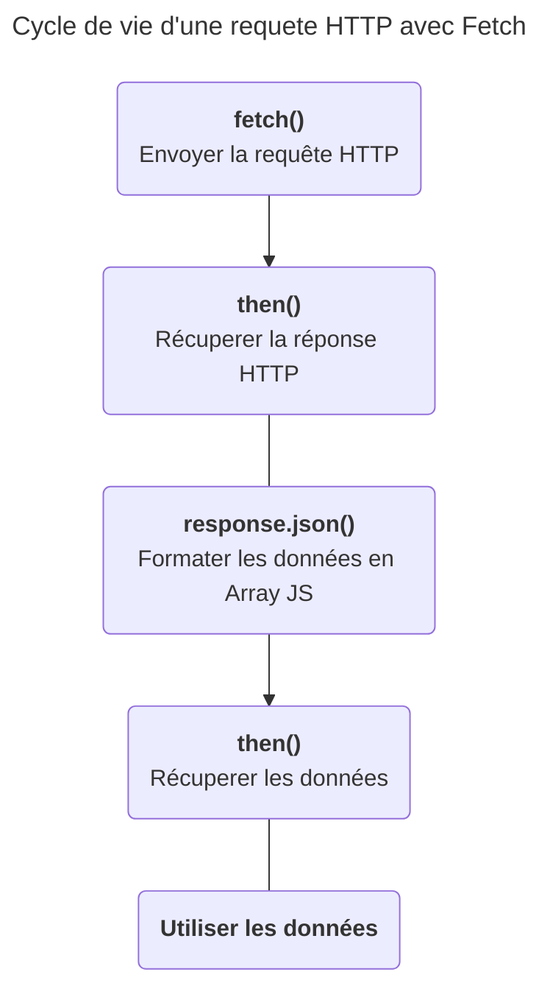
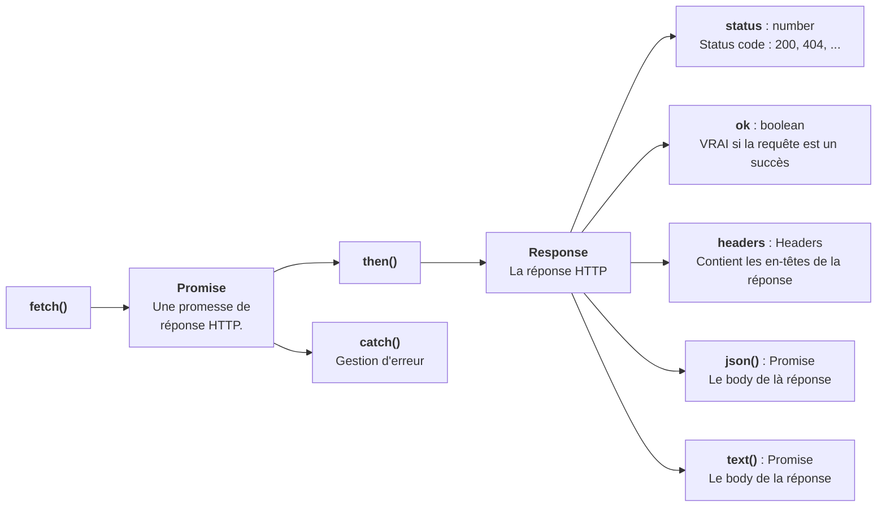

# Démonstration de fetch et comment s'en servir ?
## Tester `fetch`
Le code suivant affiche le nom des 10 premiers pokémons dans la console.
```js
fetch("https://pokebuildapi.fr/api/v1/pokemon/limit/10")
.then(response=>response.json())
.then(pokemons=>{
	pokemons.forEach(pokemon=>{
		console.log(pokemon.name);
	});
});
```
*Résultat*
```
Bulbizarre
Herbizarre
Florizarre
Salamèche 
Reptincel 
Dracaufeu 
Carapuce 
Carabaffe 
Tortank
Chenipan
```
J'utilise l'API REST Pokebuild, un serveur de données contenant tout les pokemons. On accède à ces données via des requêtes HTTP, on peut donc les récupèrer en JavaScript grâce à la fonction `fetch()`.

>Documentation de l'api PokeBuild : https://pokebuildapi.fr/api/v1

Je peux donc afficher les noms à l'écran en ajoutant une balise `<p>` dans le body pour chaque pokemon du tableau pokemons.

J'ai également ajouté un balise `.loading` qui disparait quand les données sont chargées.

```js

<!DOCTYPE html>
<html lang="en">
<head>
    <meta charset="UTF-8">
    <meta name="viewport" content="width=device-width, initial-scale=1.0">
    <title>Document</title>
</head>
<body>
    <h1>Liste des 10 premiers pokémons.</h1>
    <p class="loading">En cours de chargement...</p>

    <script>
        fetch("https://pokebuildapi.fr/api/v1/pokemon/limit/10")
        .then(response=>response.json())
        .then(pokemons=>{
            const loadingTag = document.querySelector(".loading");
            loadingTag.remove();
            pokemons.forEach(pokemon=>{
                console.log(pokemon.name);
                // J'ai le nom du pokemon 
                // Je vais l'ajouter au body
                
                // J'ai besoin d'une balise p
                const pTag = document.createElement("p");
                
                // J'ajoute le nom du pokemon dans le text de la balise
                pTag.textContent = pokemon.name;
                
                // J'ajoute la balise dans le body
                document.body.appendChild(pTag);
            });
        });
    </script>
    
</body>
</html>
```

1. Tester le programme précedent.
2. faite un `console.log(pokemons)` pour vous informez des attributs présent dans les pokemons.
2. En plus du nom affichez égaleent l'image de chaque pokémons.
3. Affichez son image et son sprite (design gameBoy)
4. Ajoutez un container-grid et affichez correctement chaque pokémon avec un displa grid. ***Code patron ci-dessus***.

```html

<!DOCTYPE html>
<html lang="fr">
<head>
    <meta charset="UTF-8">
    <meta name="viewport" content="width=device-width, initial-scale=1.0">
    <title>Document</title>
</head>
<body>
    <h1>Liste des 10 premiers pokémons.</h1>
    <p class="loading">En cours de chargement...</p>
    <div class="pokemons-grid">
        <!-- Affichez ici les pokemons... -->
    </div>

    
</body>
<script>
    // Codez ici ...        
</script>
</html>
``` 

> Pour les plus audacieux il est possible de cloner une balise existante en JS. 
> https://developer.mozilla.org/fr/docs/Web/API/Node/cloneNode
>```js
>pokemonTag = document.querySelector(".pokemon");
>clonePokemonTag = pokemonTag.cloneNode(true);
>```

### Comment se servir de la méthode `fetch()` ?
*Documentation MDN* : https://developer.mozilla.org/fr/docs/Web/API/Fetch_API/Using_Fetch

Un utilisatation classique de fetch veut que l'on envoie une requete à un serveur de données. C'est à dire un serveur qui renvoi des données brut sans aucune formatage visuel.

Dans la plupart des cas un serveur de données ne renvoi pas du HTML mais du JSON, un format de données représentant un tableau d'objet JavaScript sous la forme d'une string.

*Fetch* signifie *récupérer* un anglais et *then* signifie *ensuite*. Il faut voir la syntaxe de fetch comme ceci : 

1. "I **fetch** some data from an url ..."
2. "**then** I transform the JSON response to a JavaScript array ..."
3. "**then** I use the data."

#### Code : 
```js
fetch(url)          // Remplacez l'url par l'url de la requête HTTP à executer
.then(function(reponseHTTP){    // La fonction callback fournit la réponse HTTP
    // Les données JSON sont transformées en un tableau JS
    return reponseHTTP.json();      
})
.then(function(data){    // la 2nd fonction callback fournit les données   
    console.log(data);
    // Utiliser les données ici ...
});
```


Vous pouvez tester le coder suivant avec l'url suivante : https://pokebuildapi.fr/api/v1/pokemon/limit/10. Remplacez `url` par l'url.
Vous aurez les dix premier pokemons affichés dans la console du navigateur.

Rendez-vous sur le site de l'api pokebuild pour expérimenter avec `fetch` !
https://pokebuildapi.fr/api/v1

> **Remarque - Passage à la ligne avant `.then`**
> La méthode `then` est une méthode de la classe `Promise`, la méthode `fetch` renvoie une ``Promise``. Ici l'appel de la méthode `then` est passée à la ligne pour plus de lisibilité mais ce n'est pas obligatoire. On pourrait faire `fetch(url).then(...)` comme l'on ferait `console.log(...)`.

> **Remarque - Syntaxe raccourcis**
> L'exemple précedent utilise la syntaxe classique des fonctions anonymes, mais la syntaxe *fonction fléchée* est très utilisée pour les fonctions callback en JS, y compris la fonction callback en paramètre de la méthode `fetch.then()`.
> ```js
> fetch(url)
>.then(reponseHTTP=>reponseHTTP.json())
>.then(data=>{
>    console.log(data);
>});
>```
>Ce code produit exactement le même résultat. 
Voir les fonctions fléchées sur la MDN : https://developer.mozilla.org/fr/docs/Web/JavaScript/Reference/Functions/Arrow_functions

## II - Anti-sèche - à retenir
### Code
```js
fetch(url).then(response=>response.json())
.then(data=>{
    console.log(data);
    // Utilisez les données ici ...
})
.catch(err=>console.warn(err.message));
```
### Encapsulation des éléments.

### Documentations
- fetch() : https://developer.mozilla.org/fr/docs/Web/API/Fetch_API/Using_Fetch
- Promise : https://developer.mozilla.org/fr/docs/Web/JavaScript/Guide/Using_promises
- Promise.prototype.then() : https://developer.mozilla.org/fr/docs/Web/JavaScript/Reference/Global_Objects/Promise/then
- Promise.prototype.catch() : https://developer.mozilla.org/fr/docs/Web/JavaScript/Reference/Global_Objects/Promise/catch
- Response : https://developer.mozilla.org/en-US/docs/Web/API/Response
- Response.prototype.json() : https://developer.mozilla.org/en-US/docs/Web/API/Response/json
- Response.prototype.text() : https://developer.mozilla.org/en-US/docs/Web/API/Response/text
