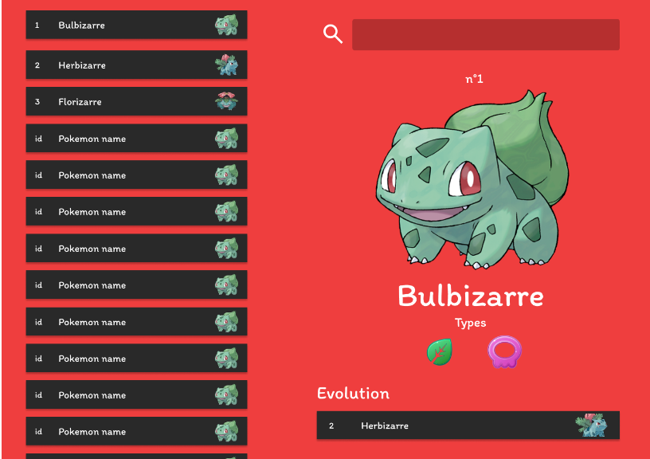

# Pokedex

Pour la récupération des pokémons nous utiliseront l'api pokebuild qui contient toutes les infos sur les pokémons

Cette API Rest est accessible via l'adresse : https://pokebuildapi.fr/api/v1

## Cahier des charges

|Tâches|
|-|
|Lister tout les pokémons dans une liste scrollable sur la gauche de l'écran.|
|Afficher les détails d'un pokémon sur la droite lorsque l'on clic sur un pokémon de la liste.|
|Afficher l'évolution du pokémon dans les détails et permettre, comme pour la liste de pokémon,
le clic sur ce pokemon pour en voir les détails.|
|Mettre en place une barre de recherche qui affiche le pokémon tapez dans le menu détails sur la droite de l'écran|

## Maquette

Voici la maquette figma qui permet de récupérer facilement les couleurs hexadécimales et les assets si besoin.

Lien figma : https://www.figma.com/file/eZkyaB5YcGxTsTgn4ZEcv2/Untitled?type=design&node-id=59%3A111&mode=design&t=QfImaCXxk6vqaSfd-1
