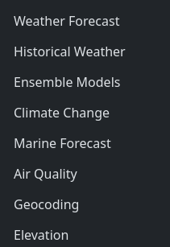

# Météo

Utilisez l'api REST https://open-meteo.com/en/docs pour conçevoir une petite application météo qui donne des informations météorologique lorsque l'on tape le nom d'une ville.

L'API REST open-meteo possède enfaite de nombreuses APIs.

A vous d'utiliser les bon outils pour concevoir votre application.

## Maquette

https://www.figma.com/proto/SxzRQi4Gdf3NkEvVr0gvg5/Untitled?node-id=1-2&t=VxVuPYHtZZgQDDAg-1&scaling=scale-down&content-scaling=fixed&page-id=0%3A1

## Cahier des charges

|Tâche|
|-|
|Barre de recherche qui affiche la météo en fonction du position gps (latitude,longitude) tapez|
| Recherche en fonction du nom de la ville.|
| Afficher une image cohérante en fonction du temps.   - pluie -> image d'un nuage pluvieux - soleil -> image d'un soleil plein - etc...
| [BONUS] : Utilisez l'api native Geolocalisation pour afficher la météo de l'utilisateur des qu'il arrive sur le site : https://developer.mozilla.org/en-US/docs/Web/API/Geolocation_API/Using_the_Geolocation_API |
| [BONUS] - Changer la couleur de fond en fonction de l'heure (jour ou nuit).

