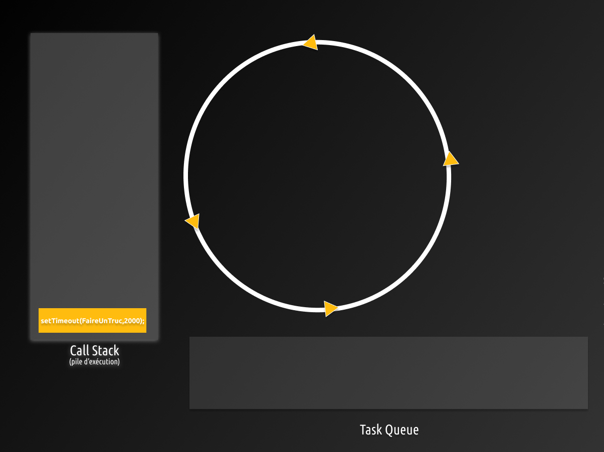
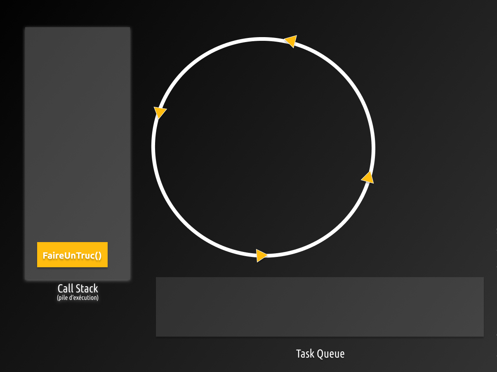

# L'asyncrone de NODEJS - Taskqueue
Avant d'étudier les API de notre JS, je vais vous parler de l'asynchrone. Et du pourquoi nodejs et ces API demande très souvent l'utilisation de fonctions fléchés.

```js
()=>{
    
    console.log("Je suis une instruction dans une fonction fléchée !!");

}
```

Pour exécuter des tâches qui sont pourtant simples dans d'autres environnements d'exécution ou langage de programmation.

Il y a 2 types d'asynchrone en javascript. 
- La Taskqueue : presque toute les taches asyncrone.
- et la microTaskqueue : les Promises.

## La Taskqueue - Comprendre setTimout, setIntervale, AddEventListener

La taskqueue. Est une file d'attente composée de fonctions. Ces fonctions ont été placées là par le code javascript pour être appelé plus tard par le navigateur, lorsqu'une certaine action s'est terminée.

> La pile d'execution est une pile similaire à la pile du processeur. Le navigateur place toutes les lignes javascript dans la pile puis elle les exécute les unes après les autres de haut en bas. 

Par exemple, les fonctions SetTimeout, SetInterval ou addEventListener en front-end fonctionnes comme ça. 

### Execution de setTimeout

```js
setTimeout(FaireUnTruc,2000);


function FaireUnTruc(){
    console.log("Tick!");
}
```

Ce programme execute la fonction FaireUnTruc 2 secondes après l'appel de setTimeout.

1. Faite tourner l'animation de la boucle d'évenement pour mieux comprendre l'ordre d'execution.

https://www.figma.com/community/file/1483112274429331648

**La fonction setTimeout est appellée dans la call stack!**


**La fonction FaireUnTruc est remisé pour plus tard dans la taskqueue**


**Après deux secondes la fonction FaireUnTruc est appellée dans la call stack.**



### Ajouter une fonction(une tache) dans la taskQueue

Il est possible d'ajouter une fonction dans la taskQueue avec la fonction setImmedate().

```js
console.log("1")
setImmediate(FaireUnTruc);

console.log("3")


function FaireUnTruc(){
    console.log("2 je suis asyncrone");
}
```

```
1
3
2 je suis asyncrone
```

La fonction FaireUnTruc est appellé après que la call stack sois vide, quand toutes les instructions du programme se sont exécutées.

## Bloquer la boucle d'évenement

D'ailleurs si une opération bloquante devrais prendre du temps la fonction FaireUnTruc pourrait ne jamais être appellée.

```js
console.log("1")
setImmediate(FaireUnTruc);

console.log("3")


function FaireUnTruc(){
    console.log("2 je suis asyncrone");
}


while(1){
    /**JE SUIS UNE OPERATION BLOQUANTE!!!! */
}
```

```
1
3

```
La boucle d'evenement est bloquée la call stack n'est donc jamais vide et donc **Les fonctions de la task queue ne sont jamais executées !**

> C'est d'ailleurs pour ça que l'on ne doit jamais utiliser `alert()` qui est une des rares fonctions bloquantes du JavScript front-end.

<!-- 
## 


## Asyncrone  et fonction callback

*app.js*
```js
import { stdin, stdout } from "process";
import {createInterface} from "readline";

// Je crée un objet qui fait interface avec les fd stdin et stdout
const logger = createInterface({
    input : stdin,
    output : stdout
});

console.log("Lecture du terminal...");

logger.question("Quel age as tu ?\n",(answer)=>{
    
    console.log(answer+" ans");        
    logger.close();
});

console.log("Fin du programme.");
```
Notez comme la réponse de l'utilisateur arrive après la dernière ligne du programme.

```bash
Lecture du terminal...
Quel age as tu ?
Fin du programme.
25
25 ans
```

Le programme c'est executé de façon asyncrone, celà signifie qu'il n'a pas attendu la réponse de l'utilisateur pour continuer son travail.

Cela signifie aussi que la fonction fléchée suivante a été *"mise de coté par nodejs"* pour être appelé plus tard".

La fonction à été rappelée plus tard on l'appel donc une fonction de rappel ou **fonction callback** en anglais
```js
(answer)=>{
    
    console.log(answer+" ans");        
    logger.close();
}
```

**Mettre de coté une fonction pour l'appeller plus tard voilà ce qu'est l'asyncrone.**

### Défintion Asyncrone
***Programmation asyncrone*** : Un programme est dit asyncrone quand il possède des instrcutions qui s'execute sans attendre la fin de l'execution d'une instruction précédente.

### Fonction callback

fonction callback : Une fonction qui est passé en paramètre d'une autre fonction pour être appelé plus tard. En JavaScript les fonctions callback sont souvent passé sous la forme d'une fonction fléchée pour simplifier le code. -->
