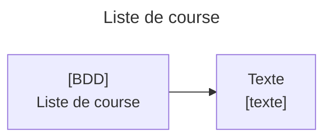
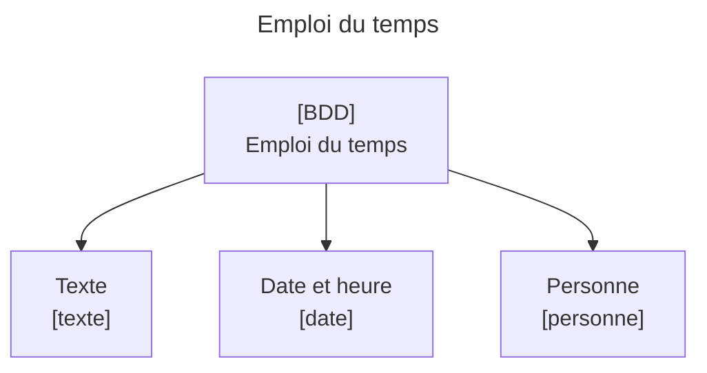
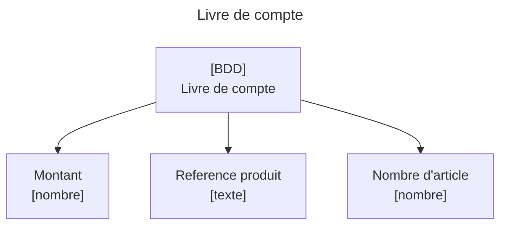
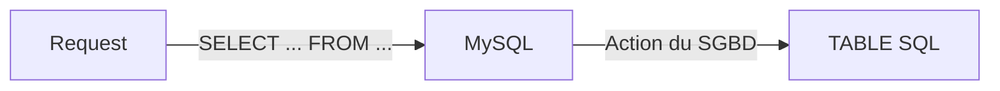
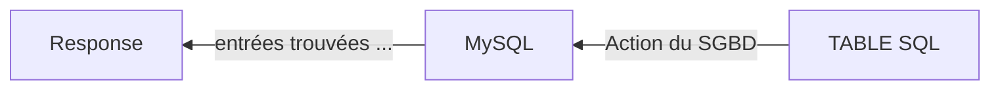

# SQL : Théorie et installation de MySQL
# Qu'est ce qu'une base de donnée ?
Une base de donnée (BDD) est un ensemble d'informations structurés. Ces informations sont appelées données. En informatiques les BDD sont partout là où les données manipulées dans le logiciel doivent persistées. 
>Si vous avez déjà été dans le cas où vous voulez concervez les valeurs de vos variables après la fin de votre programme vous aviez besoin d'une base de données.


## Pré-requis

### Installer docker
https://docs.docker.com/get-started/get-docker/

### Un serveur MySQL avec mariadb

Lancez conteneur docker mariadb en vous assurant :
- d'exporter le port 3306 (le port du docket mysql) vers l'hôte.
- de définir la variable d'envrionnement MARIADB_ROOT_PASSWORD==root


#### Comment lancer (run) un conteneur docker ?
Vous pouvez chercher puis lancer un conteneur mariadb depuis docker desktop ou docker cli.


##### Run avec Docker cli

```bash
docker run --detach -it --name bdd  -p 3306:3306 -e MARIADB_ROOT_PASSWORD mariadb:latest bash
```


##### Run avec Docker desktop

Autre alternative docker desktop

1. Dans la barre de recherche recherchez `mariadb`.
2. Télécharger l'image de mariadb en cliquant sur `pull`
> Les images sont "similaire" dans le concept au image ISO. Une image permet de fabriquer plusieurs instances de l'image appellé `container`.
> Le container est en quelque sorte le programme que vous souhaitez executer : un server http ou un node pour le back-end ou encore un server mysql
3. Cliquez sur run pour lancer un container à partir de l'image.
4. Configurez le container comme ceci :
    - container name : mariadb-server
    - Host port : 3306
    - Variable d'environnement : MARIADB_ROOT_PASSWORD=root

> Le port `3306` du socket de mysql est rendu disponible sur l'hote (votre OS) pour pouvoir permettre une application de se connecté comme un server nodejs par exemple.

5. Cliquez sur Run et rendez-vous dans l'onglet containers pour vérfiez que votre container run (pastille verte et port `3306` ouvert).


> -it permet de laiser la commande bash (présente à la fin) lacer pour éviter à notre container de se fermer immédiatement.


### Un client mysql - Faire des requêtes SQL
On va avoir besion d'un client mysql pour tester des requetes SQL et créer notre première base de donnée.

Installer un client mysql
```bash
sudo apt install mariadb-client
```

Si votre container mariadb tourne sur le port 3306 connecté vous avec le mariadb-client avec la commande suivante.

```bash
mariadb --host=127.0.0.1 --user=root --password=root
``` 

>ou avec l'alias mysql
>
>```bash
>mysql --host=127.0.0.1 --user=root --password=root
>``` 

Un prompt doit apparaitre : 

```bash
MariaDB [(none)]> 
```

### Créer une bdd pour notre application

```sql
CREATE DATABASE my_back
```

Je peux voir mes databases avec la commande SHOW DATABASES;

```sql
SHOW DATABASES;
```


> Vous pouvez créer autant de base de données différente, le plus souvent une pour chaque projet. Vous pouvez les nommer par le nom du projet.

## Exercices SQL
1. *<a href="https://www.w3schools.com/sql/sql_intro.asp">Pratiquer les requetes précedents sur w3schools.com</a>*

Les requêtes SQL sont divisées en deux catégories :

- Les requêtes à une base de donnée (au niveau d'une seul BDD) : 
    - select from where
    - insert into
    - delete from where
    - join
- Les requêtes d'adminisation de mysql/mariadb( en dehors de toute base de donnée) :
    - CREATE DATABASE
    - DROP DATABASE
    - ALTER TABLE

Typiquement les requêtes présentes dans le code sont les requêtes sont dans la première catégorie.


## Les BDD au quotidien
Vous etes quotidiennement confrontés à des base de données :
- **Votre liste de course** est un ensemble de `texte`, les informations sont potentiellement associés à un `numéro` qui les identifies et les ordonnes. *Un `texte` et un `numéro` voilà la structure des données d'une liste de course.*

- **Votre emploi du temps** est un ensemble de données où chaque donnée est faite à minima d'un `texte`, d'une `date/heure` et d'une `personne`. *Un `texte`, une `date` et une `personne` voilà la structure des données d'un emploi du temps.*

- **Un livre de compte**, est un ensemble de données où chaque donnée est fait d'un `montant`, d'une `reference` d'article et d'un `nombre` d'article. *Un `nombre`(montant), un `texte` (reference) et un `nombre`(nombre d'article) voilà la structure des données d'un livre de compte.*

Vous commencez à comprendre qu'une structure de donnée, y compris dans les bases de données de la vie quotidienne, se résume à un ensemble de type de données. Et les types de données et la programmation ça va bien ensemble. ;)

### En résumé
- **Une base de données est un ensemble de donnée**
- **Les données sont des structure de données**
- **Les élements** d'une structure de données **sont typés** (nombre, texte, date, ...)


## Les bases de données en informatique
En informatique une base de donnée est également un ensemble de données structurées.
> Par donnée structurées ont entend : donnée qui respecte une structure de données où chaque membre possède un type.

Quelques exemple de base de données en informatique :
- **Tableau CSV**, format textuel qui sépare chaque colonne par une virgule et chaque ligne par un passage à la ligne résultant en une base donnée dont la structure de chaque ligne est défini par le nom des colonnes. Le format CSV est utilisé par exemple par Excel et LibreOffice pour formater des tableurs et par WordPress pour exporter ou importer des produits d'une boutique e-commerce.
- **Tableau JSON**, format textuel qui sépare des objets par une virgule dans une syntaxe proche du JavaScript. Il est très utilisé par les serveur web pour envoyer des données ou pour paramètrer facilement un logiciel : les raccourcis de VSCode et les dépendances d'un projet NodeJS sont défini dans un fichier JSON.
- **Le localStorage d'un navigateur**, une base de donnée qui formate ses données via une pair de clé valeur qui sont toutes les deux des string.
- **IndexedDB**, une base de donnée qui formate ses données sous la forme de table d'objets JavaScript. A la différence du JSON IndexedDB n'est pas juste un fichier texte à modifier mais une programme complet avec ses fonctions et variables permettent de manipuler la BDD.
- **Les base de données SQL** formatent leurs données dans des tables composées de colonnes et de lignes. Chaque colonne possède un nom et un type données. Les tables de données SQL ne sont pas isolées les unes des autres et peuvent est mises en relation. On mettre dans une base de donnée SQL plusieurs tables d'un même thême : Produits, Categories, Reductions, TarifLivraisons, etc.

>Vous remarquerez qu'une bonne parties des bases de données en informatique sont representées sous la forme de tableau où chaque lignes represente une donnée et chaque données est défini par des colonnes.

En fonction des bases de données les colonnes peuvent être défini avec plus où moins de précision. CSV ne contient que du texte et laissera au développeur le soins de transformer "5.87" en un montant en euro, alors que SQL permet de définir de nombreuses options comme : le type, si la données est unique ou si elle peut être supérieur à zero, etc.

**C'est par ce que les bases de données SQL sont précises et que tout un langage permet de les manipuler, quelles figure parmit les BDD les plus utilisés en déveleppement web.**

# Le SQL - Structured Query Language
Le **SQL** ou **S**tructured **Q**uery **L**anguage est un langage de requête qui permet via un programme nommé système de gestion de base de donnée (SGBD) d'accès à des bases de données SQL en envoyant des requêtes.

Le requete SQL respecte les norme du langage SQL dont vous trouverez un inventaire des requêtes et fonctions ici : https://sql.sh/.

# Le système de gestion de bases de données - SGBD
Les SGBD sont des programmes qui reçoivent des requêtes SQL et envoi des réponses.
Les SGDB les plus populaire sont **MySQL**, **PostGreSQL** et **SQLite**.
## MySQL et MariaDB
MySQL est le SGBD le plus *classique*, il implemente le langage SQL et permet la connexion au BDD SQL à distance. Il est très bien supporté par la plupart des langages de programmtion comme le PHP, Python ou le langage C. MySQL est un logiciel open-source et propriétaire développer par Sun et Oracle. Une version libre de MySQL appelé MariaDB existe est est developpé par l'auteur original de MySQL et la communauté open-source.

## PostgreSQL
PostgreSQL est un SGDB similaire à MySQL mais plus adaptées à de gros volume de données plus complexes.

## SQLite
SQLite est un SGBD embarqué, à la différence de MySQL et Postgre qui neccessite d'être installés et configurés le plus souvent sur des serveurs, SQLite est un SGBD plus léger; utilisé par exemple, dans les bases de données des applications mobile, qui doivent pouvoir stocker efficacement des données même hors ligne dans le cas où l'utilisateur n'à pas de réseau.

> **Sites officiels**
> MySQL : https://www.mysql.com/fr/
> MariaDB : https://mariadb.org/
> PostgreSQL : https://www.postgresql.org/
> SQLite : https://www.sqlite.org/index.html


## Qu'est ce qu'une requete SQL ?

- Une requête SQL une ligne de code qui décrit une action à effectuer par le SGBD sur une base de données. 
- Une requête SQL est composé des mot-clé séparés par - des espaces et finissent par un point-virgule.
- Les requêtes SQL sont plutot proches de l'anglais et par convention les mot clé sont écrits en majuscules.

Par exemple, prenons une table SQL nommé **product**  défini comme suit :
*product*
|id|reference|price|
|---|---|---|
|1|"gameboy advance"|25|
|2|"XBOX 360"|130|
|3|"PS5"|699.99|

Selon vous la requête SQL suivant produira quel résultat ?
```sql
SELECT reference,price FROM product WHERE product.price > 100; 
```
***Selectionne** la réference et le prix des produits **où** le prix est supérieur à 100 **depuis** la table produits*

*Résulat - 2 entrées trouvées*
reference|price|
|---|---|
|"XBOX 360"|130|
|"PS5"|699.99|

Si l'on envoi cette requete depuis un langage de programmation le résultat sera donc un array de deux élement directement exploitable.


