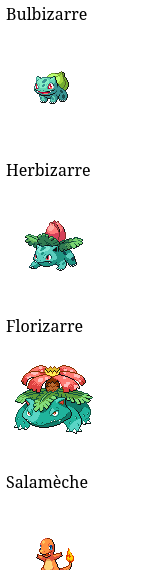

# Les prommesses JavaScript

Le JavaScript fonctionne en deux temps :
- Le code JS est executé de haut en bas 
- puis la boucle d'evennement(event loop) du JS commence.

## La boucle d'évennement

L'event loop est une boucle while qui, en fonction de l'envrionnement d'exection execute les même actions en boucle.

Cette boucle d'évenement permet entre autres de réagir à des évenements extérieur comme :
- le clic d'une souris
- le déplacement d'une souris
- une réponse HTTP démandé par un appel de la fonction fetch()
- un setTimeout prévu à l'éxcution.

https://developer.mozilla.org/en-US/docs/Web/JavaScript/Event_loop

Voyez la boucle d'évenement comme un train qui va s'arreter à plusieurs gare et ajouter à la pile d'exection (la stack) tout les instructions qu'il y croise.

## Asyncrone

Comme dit précedemment votre code est entièrement executé avant le début de l'event loop.

Mais il est tout de même possible de prévoir des actions pour plus tard (asyncrone) grâce que fonctions callback.

### L'asynrone de la task queue
La fonction permettant une action asyncrone la plus classique est setTimeout.
```js
console.log("1. début");
setTimeout(()=>{
    console.log("2. Je suis asyncrone");
},2000);
console.log("3. fin");
```

Ce qui produit ce résultat :

```bash
1. début
3. fin
2. Je suis asyncrone
```

**La fonction callback passée à setTimeout à été placer de coté pour être ajoutée à la taskqueue 2s plus tard**.

Ces actions asycrone sont applée `callback based` est il existe un grand nombre de fonction asynrone de ce genre dans les navigateur ou nodejs.

Cependant depuis une dizaine d'année un autre genre de fonction asyncrone on été normalisé et leurs syntaxe permet d'améliorer fortement la lisbilité du code et la gestion des erreurs d'execution.

### L'asyncrone des microtask
Une microtask est une fonction fournit à la microtaskqueue pour etre executé plus tard, de façon similaire la taskqueue.

Il existe une fonction qui permet de rendre une fonction asyncrone : `queueMicrotask()`.

```js
console.log("1. début");
setTimeout(()=>{
    console.log("2. Je suis une microtask asyncrone ");
},2000);
console.log("3. fin");
```

#### Microtask prioritaire et ordonnée

Les microtask sont executé dans leurs ordre d'appel mais avant le tasks classique.

```js
console.log("1. début");

setTimeout(()=>{
    console.log("2. Je suis asyncrone setTimeout");
},0); // 0 => appellée dès que possible

queueMicrotask(()=>{
    console.log("3. microtask 1");
})

queueMicrotask(()=>{
    console.log("3. microtask 2");
})

queueMicrotask(()=>{
    console.log("3. microtask 3");
})

console.log("4. fin");
```

1. Executer le programme précedent et observez l'ordre d'execution des fonctions callback.

### Les Promises
La fonction queueMicroTask est une primitve bas niveau du JavaScript peu de genre l'utilise directement, a la place on préfère la classe Promise qui possède tout un tas de méthodes et fonctionnalités très pratique.

Pour faire simple : les promesses sont une encasulations moderne des microtask et la majorité les API et frameworks moderne fournise leurs données asyncrone via les Promises.

#### Exemple une requête http

##### Syntaxe callback then, catch

```js
fetch("https://pokebuildapi.fr/api/v1/pokemon/limit/10")
.then(res=>res.json())
.then(pokemons=>{
    // Mon tableau de pokemon est disponible
    console.log(pokemons); 

    for(const pokemon of pokemons){
        console.log(pokemon.name); 
    }
})
.catch(error=>console.error(error));
```

- La fonction `fetch` effectue une requete http sur l'url.
- le premier `then` est executé quand la réponse http arrive.
- le premier `then` décode les donnée du body de la réponse http et renvoi le résultat au `then` suivant
- Le deuxième `then` récupère un `Array` d'objet et s'en sert.

Je peux par exemple afficher le nom des pokémons dans du html si j'execute ce script dans le browser.

```js
fetch("https://pokebuildapi.fr/api/v1/pokemon/limit/10")
.then(res=>res.json())
.then(pokemons=>{
    // Mon tableau de pokemon est disponible
    console.log(pokemons); 

    for(const pokemon of pokemons){
        const p = document.createElement("p");
        p.textContent = pokemon.name;

        const img = document.createElement("img");
        img.setAttribute("src",pokemon.sprite);
        
        document.body.appendChild(p);
        document.body.appendChild(img);
    }
})
.catch(error=>console.error(error));
```

