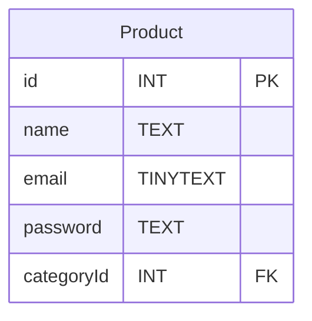

# DTO - Data Transfer Object

1DTO est une structure de données qui définit les champs d'un objet métier tel qu'il est consommé dans le code d'une application. 

A l'inverse du modèle, le DTO ne doit pas nécessairement représenter une table de la persistance des données. 

Son rôle est simplement d'apporter une structure uniforme à toutes les fonctions de l'application. Sans contraindre la mise à jour massive de code, comme le ferait un modèle lorsque la structure d'une table SQL change par exemple.

>Voir l'article *medium* suivant :
>https://dev.to/tareksalem/dtos-in-javascript-118p

## Exemple en TypeScript


Soit la table SQL suivante :



*product.model.ts*
```ts
export interface ProductModel{
    id : number
    name : string
    email : string
    password : string
    categoryId : number 
}
```

*product.repository.ts*
```ts

import {connection} from "core/database.ts"

export class ProductRepository{
    static getAllProducts() : Promise<Product[]>
    {
        return new Promise((resolve,reject)=>{

            connection.execute("SELECT * FROM  ",(err,products : Products[])=>{
                if(err){
                    reject(err);
                }
                else{
                    resolve(products);
                }
            });
        }
    }

    static getProduct(id:number) : Promise<Product | null>
    {
        return new Promise((resolve,reject)=>{
            // J'utilise une requete préparé pour éviter une injection SQL.
            connection.execute('SELECT * FROM Product WHERE id=?', [id], (err, products) =>{
                if(err){
                    reject(err);
                }
                else{
                    resolve(products);
                }
            });

        });
    }

    static addProduct(newProduct:Product) : Promise<number>
    {
        return new Promise((resolve,reject)=>{
            // J'utilise une requete préparé pour éviter une injection SQL.
            connection.execute('INSERT INTO Product (name,email,password,cateogryId) VALUES (?,?,?,?)', [product.name,product.email,product.password,product.categoryId], (err, results) =>{
                if(err){
                    reject(err);
                }
                else{
                    resolve(results);
                }
            });

        })
    }
}
```


