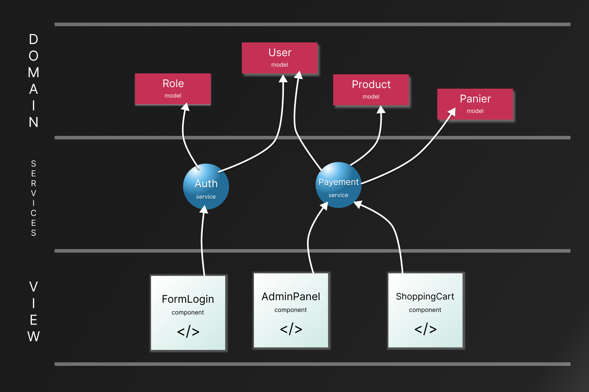
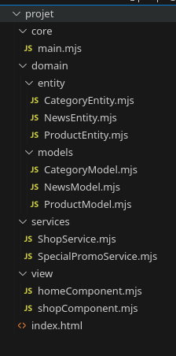

# Structurer un projet - Domain driven Developpement (DDD) et Inversion de controle
Le DDD est une méthode d'organisation du code de façon à le séparer en 3 ensembles de modules orientées vers les objets métiers.

> Un objet métier est une Structure de donnée très lien au besoin client comme : un client, un produit, un commentaire, un message, un salon de disscution, un panier.

Le DDD simplifie la reflexion du dévleppeur quant à l'architecture des fichiers de son logiciels. Car la DDD défini des normes à suvivre.

## 3 Couches
Un module est une classe ou un ensemble de fonctions et variables contenu dans un dossier. Un module est une eccapsulation.

Le DDD possède 3 couches et chaques couches sont composés de modules.

- Domain : Défini les objets métier de l'application,les *Entity*( voir les exemples d'objets mértier dans l'annotation plus haut). Contient souvent des requête SQL et des accès direct au systèmes de fichiers. Les modules de la couches domaine sont appelées Model et ils gère chaqu'un une Entity(carractéristiques d'un objet métier).

- Services (ou application) : Ce sont des modules utilisés par la couche d'affichage (View), comme : AuthenticationService, PayementService, StateManagementService. Ces modules services utilises les Models de la couches Domain pour accèder à des données en rapport avec les objets métiers (Entity)

- View (UI) : Les briques composants l'interface utilisateurs. L'affichage en somme.

-**Couche SPECIAL - Core** : Contient la fonction `main()` le point de départ de l'application. 

Cette séparation en couche permet de ne plus modifier la fonction main() et force le dévelppeur à constrire des petites briques d'application ( les modules ). Cette "perte" de controle de la fonction `main()` s'appelle l'Inversion de Control ou Inversion de dépendence, c'est le *I* du principe *SOLID*.

## Schéma D'un projet



Pour un projet web par exemple :

```
--------------DOMAIN------------------
        PHP ou JavaScript et SQL
--------------------------------------

-------------SERVICES-----------------
          PHP ou JavaScript
--------------------------------------

---------------VIEW-------------------
            HTML et CSS 
                +
        un peu de JS ou PHP
            pour afficher
             des données
--------------------------------------
```

## Organiser les dossiers

Voici un exemple d'application web orientée domaine de type vente en ligne de *produit* *catégorisé*. La boutique fait également parfois des *promotion*.

### Capture d'écran d'une archi Domain driven




### Domain : 

- Produit,catégorie, promotion voilà nos objets métiers. Nos Entités.

- Ils possèdes chacun un ensemble de fonctions placées dans leur Model respectifs.

### Services et View : 

- La page d'accueil affiche les promotions actuels et utilise donc le service SpecialPromoS qui contient des fonctions pour accéder facilement aux promotions. Ainsi que le ShopService pour afficher quelque produits phares.

- La page *shop* quant à elle utilise le ShopService

## Conclusion

Le Domain driven developpement permet de rendre le code modulaire et de créer des abstractions (services) facile d'utilisations pour les composants de vue (view). Aussi sont design orientée objet métier (Entity) pousse à modéliser (Model) sont application au service du besoin métier (du client).

## Git Clone le projet

