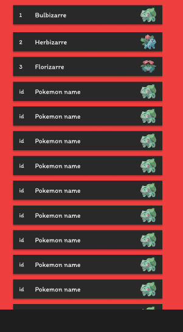
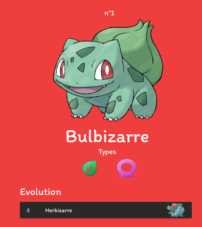

# TP Pokemon React
Dans ce TP vous serez accompagné dans la création d'un pokedex.


Pour la récupération des pokémons nous utiliseront l'api pokebuild qui contient toutes les infos sur les pokémons.

Cette API Rest est accessible via l'adresse : https://pokebuildapi.fr/api/v1


## Fonctionnalités
|Tâches|
|-|
| **Lister tout les pokémons** dans une liste *scrollable* sur la gauche de l'écran.
| **Afficher les détails d'un pokémon** sur la droite lorsque l'on clic sur un pokémon de la liste.
| **Afficher l'évolution du pokémon** dans les détails et permettre, comme pour la liste de pokémon, le clic sur ce pokemon pour en voir les détails.
| **Mettre en place une barre de recherche** qui affiche le pokémon tapez dans le menu détails d'un pokemon sur la droite de l'écran.

## Maquette
Voici la maquette sur *figma* qui permet de récupérer facilement les couleurs hexadécimale.

Lien **figma** : https://www.figma.com/file/eZkyaB5YcGxTsTgn4ZEcv2/Untitled?type=design&node-id=59%3A111&mode=design&t=QfImaCXxk6vqaSfd-1


> A partir de là vous pouvez très bien tenter par vous même de coder le projet avant de suivre ce TP. Petit conseil, les urls d'accès à l'API Pokebuild sont décrites sur leur site.

## Compétences utilisées dans ce TP
- Créer un composant React avec JSX.
- Ajouter des props à un composant
- Gérer les événements click et change du navigateur via les props onClick et onChange de React.
- Ajouter des states à un composant.
- Savoir découper une maquette en une arboresence de composants.
- Utiliser l'API Fetch pour effectuer une requête HTTP.


# Mise en place du projet
1. Ouvrez VScode dans le dossier ou vous souhaitez retrouvez vos projets.
2. Ouvrez un Terminal de commande.
3. Créer un pokedex React avec `Vite` nommée pokedex
```bash
npm create vite # Crée le projet
cd pokedex      # Deplace le terminal dans le projet
npm install     # Installe les dépendances node_modules
npm run dev     # Lance le serveur web
```
4. Ouvrez le projet dans le navigateur (*localhost*).
5. Supprimer tout le contenu du dossier /src SAUF main.jsx
6. Dans main.jsx supprimer la ligne d'import du css et du composant App
```jsx
// Ligne à supprimer ces fichier n'existe plus.
import App from './App.jsx'
import './index.css' 
```

Votre fichier *main.jsx* devrait contenir ce code.
*/src/main.jsx*
```jsx
import React from 'react'
import ReactDOM from 'react-dom/client'

ReactDOM.createRoot(document.getElementById('root')).render(
  <React.StrictMode>
  </React.StrictMode>,
)
```
7. Créer un dossier nommée *components* dans */src/* ils contiendra tout nos composants d'UI.

Voilà le projet est en place vous avez simplement crée un projet et supprimé les fichiers d'exemple de *Vite*, aussi nous avons crée un dossier components dans lequel nous developperont nos composants d'UI.

# Diviser la maquette en composants
La première étape du developpement d'une application React est le découpage de la maquette. Elle permet de définir les composants qu'il faut créer et leurs arboresence.

Comptez les composants de cette maquette et essayé de les nommées.

Il y en a combien selon-vous ?


La bonne réponse était 4 sans compter le composant racine `App`. Il serait possible d'en découper plus ou même moins mais 4 me parait être la solution la plus adaptée à ce TP.

Le composant `<Pokemon>` qui est utilisé dans la liste des pokemons et le détail du pokemon pour indiquer son évolution.
.png)

Le composant `<PokemonList>` qui liste tout les pokémons existant dans un menu défilable.
.png)

Le composant `<SearchBar>` qui permet de rechercher un pokemon pour ensuite l'afficher dans le détail du pokémon.
.png)

Et enfin, le composant `<PokemonDetail>` qui affiche les informations d'un pokemon (nom, id, image, types et évolution) lorsque que l'utilisateur clique sur un `<Pokemon>` ou recherche un pokemon avec la `<SearchBar>`.
.png)

# Définir l'arboresence du projet

Une fois les différents composant identifiés ont remarque une arboresence qui se dessine.
```mermaid
flowchart
App["< App >"]
Pokemon["< Pokemon >"]
Pokemon2["< Pokemon >"]
PokemonList["< PokemonList >"]
SearchBar["< SearchBar >"]
PokemonDetail["< PokemonDetail >"]

App--oPokemonList
App--oSearchBar
App--oPokemonDetail
PokemonList--oPokemon
PokemonDetail--oPokemon2
```
.png)

Il est important d'avoir consience de cette arboresence pour pouvoir, plus tard, faire remonter des évenements des composants enfants vers le composant `<App />` via des props. 

Par exemple si l'utilisateur clique un `<Pokemon />` le pokemon affichée dans `<PokemonDetail/>` sera modifiée. `<Pokemon />` et `<PokemonDetail />` ne sont pas forcement directement liés mais il sont tout enfants du noeud `<App/>` qui va donc pouvoir les chapeautés via des `states`.

En parlant de `<App/>` il est temps de le créer.

# Créer le composant racine App
La première chose à faire dans un projet React c'est créer le composant racine qui contiendra tout nos composants.

La création d'un composant se fait en plusieurs étapes :
- Créer un fichier *.jsx* qui contient une fonction exporté renvoyant du JSX.
- Créer un fichier *.css* que l'on importe dans le fichier .jsx, en effet grâce à vite on va pouvoir importer du CSS dans le fichier .jsx sans avoir besoin de toucher au index.html.
- Ajouter le composant App dans la fonction render du *main.jsx* 

C'est parti.

## Créer le fichier JSX
Dans le dossier */src/components* créer un fichier nommée *App.jsx*. 
Il contient le code minium d'un composant à savoir une `<div>` avec un petit message pour s'assurer que tout fonctionne.

*/src/components/App.jsx*
```jsx
export function App(){
    return (
        <div>
            <p>Hello App</p>
        </div>
    )
}
```
## Importer le composant dans *main.jsx*
*/src/main.jsx*
```jsx
import React from 'react';
import ReactDOM from 'react-dom/client';
import {App} from "./components/App";

ReactDOM.createRoot(document.getElementById('root')).render(
  <React.StrictMode>
    <App />
  </React.StrictMode>,
);
```

## Importer le CSS
Grâce à *Vite* il est possible d'utiliser *import* pour importer un fichier css dans un fichier *.js* ou *.jsx*.

Créer le fichier *App.css* suivant dans */components*.
*/src/components/App.css*
```css
body{
    background-color: #EF3E3E;
    color : white;
    font-family: sans-serif;
}
```

Puis importer le css dans *App.jsx*.
*/src/components/App.jsx*
```jsx
import "./App.css";
export function App() {
    return (
        <div>
            <p>Hello App</p>
        </div>
    );
}
```


Maintenant que votre projet est mis en place vous pouvez commencez à gagner en autonomie. Pour la suite du projet, je vous demande d'abord d'essayer de faire les composants par vous-même avant de regarder la solution.

Je vous donnerai tout de même des indications en préambule de chaque création de composant.

# Le composant Pokemon
La première chose à faire c'est créer le composant Pokemon, ont en a besoin dans presque tout les composants de notre application.

## Maquette du composant


Le composant sera appelé de cette manière.
```jsx
<Pokemon pokemon={bulbizarre} onClickPokemon={(pokemon)=>{console.log(pokemon)}}/>
```

## Récupérer les pokemons
Pour afficher un pokemon il faut pouvoir récupérer les pokémons dans notre composant App.

On souhaite donc passer en props a App les 100 premier pokémons grâce à fetch().

>Voir le cours sur fetch : https://developer.mozilla.org/fr/docs/Web/API/Fetch_API/Using_Fetch
>Voir le cours sur les promises : https://developer.mozilla.org/fr/docs/Web/JavaScript/Reference/Global_Objects/Promise

*/main.jsx*
```jsx
import React from 'react'
import ReactDOM from 'react-dom/client'
import {App} from './components/App.jsx'

fetch("https://pokebuildapi.fr/api/v1/pokemon/limit/100")
.then(res=>res.json())
.then(pokemons=>{
  ReactDOM.createRoot(document.getElementById('root')).render(
    <React.StrictMode>
      <App pokemons={pokemons}/>
    </React.StrictMode>,
  );
});
```

Et donc dans App on rajoute la prop `pokemons`.
*/src/components/App.jsx*
```jsx
import "./App.css";
export function App({pokemons}) {
    console.log(pokemons);
    const bulbizarre = pokemons[0];
    console.log(bulbizarre);
    return (
        <div>
            <p>Hello App</p>
        </div>
    );
}
```

## Activité 1
***Consigne : Créez le composant Pokemon.***

.png)
Le composant doit :

- Afficher le nom, l'id et l'image du pokemon.

Le composant sera appelé de cette manière.
```jsx
<Pokemon pokemon={bulbizarre}/>
```

# Le composant PokemonList
## Activité 2
***Consigne : Créez le composant PokemonList.***



Afficher tout les pokemons

Le composant doit :
- Afficher tout les pokemons dans une liste scrollable.

Le composant sera appelé de cette manière.
```jsx
<PokemonList pokemons = {pokemons}/>
```
Vous aurez besoin de la fonctions map.

# Le composant PokemonDetail
## Activité 3
***Consigne : Créez le composant PokemonDetail.***

Le composant PokemonDetail affiche les details d'un pokemon, ce pokemon est passé en tant que prop.

On lui passe également son évolution en tant que prop.

Le pokemon passé en prop doit etre un `state` car il a vocation à changer lors du clic sur un Pokemon.

Ce state s'appelle currentPokemon.

Rajouter le state dans App.
```jsx
import "./App.css";
export function App({pokemons}) {
    const [currentPokemon,setPokemon] = useState(pokemons[0]);
    const evolution = /** TODO */

    return (
        <div>
            <PokemonList pokemons={pokemons}/>
            <PokemonDetail pokemon={currentPokemon} evolution={evolution}/>
        </div>
    );
}
```

# Modifier PokemonDetail avec le clic sur un Pokemon
## Activité 4
Lorsque l'on clic sur un composant Pokemon le pokémon actuellement affichée dans PokemonDetail(currentPokemon) change.
Cependant le state currentPokemon n'est accesible que dans APP.

Vous devez donc faire passer le pokemon cliqué de PokemonList a App pour pouvoir modifier le state currentPokemon.

# SearchBar
## Activité 5

Crer un composant SearchBar qui effectue un fetch lorsque l'utilisateur ecrit au clavier.

Le fetch s'effectue sur le lien : https://pokebuildapi.fr/api/v1/pokemon/Gruikui
Il permet de récuperer un pokemon via son nom ou son id.

Le resultat de cette recherche est passer à App pour modifier le state currentPokemon et ainsi modifier l'affichage de PokemonDetail.


<!-- ### TODO
- Diviser la maquette en composants
- Créer le projet et mettre en place le composant `<App/>`
- Ajout du CSS au composant `<App/>`
- Le composant Pokemon
- Le composant PokemonList
- Le composant PokemonDetail
- Le composant  -->
