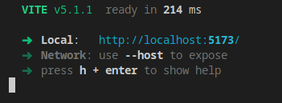
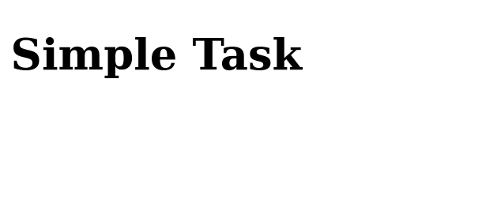
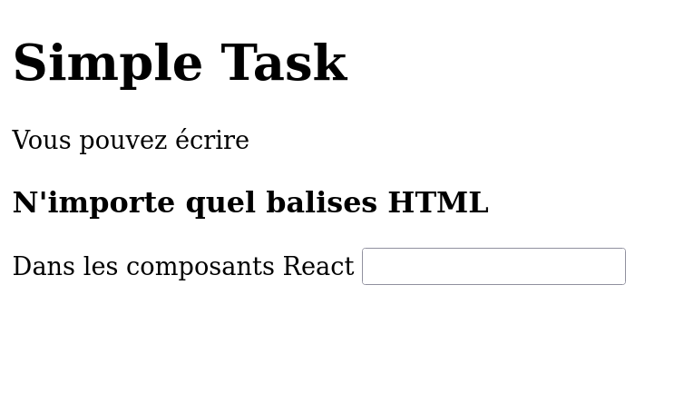
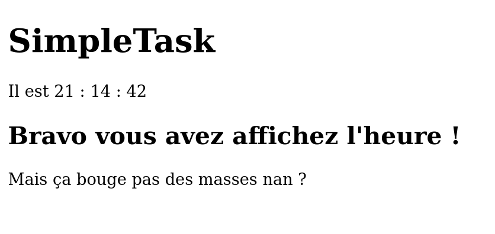
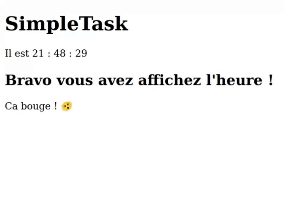
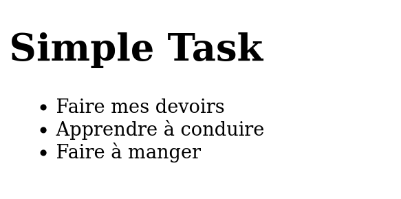

# Apprendre React
On va créer *"une liste de tâche à faire"* avec React.

Testez le rendu final en téléchargant le projet sur votre pc.

```bash
git clone "https://github.com/CHAOUCHI/ReactSimpleNotesCDA.git"
cd simple-task
npm install
npm run dev
```

Dans cette appli toute simple je peux :
- Ajouter des tâches
- Voir les tâches que j'ajoutes

## Mise en place du projet
Démarrez un projet React JavaScript avec Vite et nommé le `simple-task`.
```bash
npm create vite
cd simple-task
npm install
npm run dev
```

Supprimez tout le contenu du dossier `src`.

Dans le dossier `src` :

1. Créez le fichier *main.jsx* suivant
```jsx
import React from 'react'
import ReactDOM from 'react-dom/client'
import {App} from './App.jsx'

ReactDOM.createRoot(document.getElementById('root')).render(
  <React.StrictMode>
    <App />
  </React.StrictMode>,
)
```

2. Créez le fichier *App.jsx* suivant
```jsx
export function App() {
  return (
    <div>
      <h1>Simple Task</h1>
    </div>
  )
}
```

Ouvrez votre application sur votre navigateur à l'adresse localhost fournit par *Vite*.

Voilà le projet est en place.


## Les composants
Un application web est faites de composants, c'est à dire de plusieurs blocs d'UI comme des listes de produits, des barres de recherche, des profils utilisateurs.

### Le composant racine App
Le composant App est le point d'entrée de notre application.

Il renvoi des balises HTML à afficher dans ma page. Vous pouvez évidement construire votre page en écrivant du HTML dans le div retournée par App.

```jsx
export function App() {
  return (
    <div>
      <h1>Simple Task</h1>
      <p>Vous pouvez écrire</p>
      <h3>N'importe quel balises HTML</h3>
      <div>
          <label > Dans les composants React </label>
          <input type="text" name="" id="" />
      </div>
    </div>
  )
}
```

> Attention écrivez exclusivement votre HTML entre les balises div du composant App.



## Afficher une variable dans le HTML

Vous imaginez bien que React ne permet pas juste d'écrire du HTML statique. L'interet de React c'est la facilité avec laquelle je peut ajouter du JavaScript à l'interieur.

```jsx
export function App() {
    let appName = "SimpleTask";
    let task = "Faire les courses";

    return (
        <div>
            <h1>{appName}</h1>
            <ul>
                <li>{task}</li>
            </ul>
        </div>
    )
}
```
Ici je déclare deux variables que j'affiche directement dans le HTML.

Pour "passer en mode JS" dans mon HTML il me suffit d'ouvrir des accolades à n'importe quel endroit de mon HTML. Tout valeur qui se trouve dans les accolades sera placée dans le HTML.

```jsx
export function App() {
  const appName = "SimpleTask";
  const date = new Date();
  return (
    <div>
      <h1>{appName}</h1>
      <p>Il est {date.getHours()} : {date.getMinutes()} : {date.getSeconds()} </p>
      <h2>Bravo vous avez affiché l'heure !</h2>
      <p>Mais ça bouge pas des masses nan ?</p>
    </div>
  )
}
```


## Les states

React permet d'afficher du JavaScript dans du HTML c'est vrai, mais React permet surtout créer des variables qui mettent à jour automatiquement l'affichage quand elle sont modifié.

Ont appelles ces variables des états (*states*) se sont des variables qui, lorsqu'elle sont modifiées, mettent à jour l'affichage du composant.

### Exemple 1 une horloge
Ici je vais faire de ma `date` un state pour que l'heure se mettent à jours quand on la modifie.

Pour créer un state je doit utiliser la fonction `useState`. Elle me fournit un etat date et une fonction qui permet de modifier cet etat.
```jsx
const [date,setDate] = useState(new Date());
```

*/src/App.jsx*
```jsx
import { useState } from "react";

export function App() {
  const appName = "SimpleTask";

  const [date,setDate] = useState(new Date());

  // Dans une seconde...
  setTimeout(()=>{
      // Je met à jours la date
      setDate(new Date());
  },1000);

  return (
    <div>
      <h1>{appName}</h1>
      <p>Il est {date.getHours()} : {date.getMinutes()} : {date.getSeconds()} </p>
      <h2>Bravo vous avez affiché l'heure !</h2>
      <p>Ca bouge ! 🫨</p>
    </div>
  )
}
```



>Un state est une variables qui lorsque elle est modifiée met à jour l'affichage de son composant. Etant donné que React doit effectuer des actions de son coté pour mettre à jour l'affichage du composant il faut utiliser la fonction setNomDuState pour mettre à jours le state.
>Les state sont une des features les plus important de réact. Si vous devez affichez quelque chose qui doit changer avec le temps ou en fonction de clic, d'input utilisateurs ou autres il vous faut un state.

## Exemple 2 - Incrementation
Un autre exemple de state est un bouton d'incrementation.

Je souhaite augmenter le nombre de produit de mon panier quand je clic sur un bouton.

```jsx
import { useState } from "react";

export function App() {
  const [count,setCount] = useState(0);
  return (
    <div>
      <p>Nike air</p>
      <p>{count} produits dans le panier.</p>
      <button>Ajouter un produit</button>
    </div>
  )
}
```

React me permet de réagir à l'évenement "click" d'une balise HTML en lui fournissant une fonction.

```jsx
import { useState } from "react";

export function App() {
  const [count,setCount] = useState(0);

  return (
    <div>
      <p>Nike air</p>
      <p>{count} produits dans le panier.</p>
      <button onClick={ ()=>{setCount(count+1)} } >Ajouter un produit</button>
    </div>
  )
}
```
***Quand l'évenement click apparait sur le bouton : appel la fonction flechée `()=>{ setCount(count+1) }`.***

*onClick* est une propriété fournit par React. Cette propriété prend pour valeur une fonction.

```jsx
<button onClick={ ()=>{setCount(count+1)} } >Ajouter un produit</button>
```

> C'est le même principe qu'une fonction fléchée passée dans une fonction addEventListener mais cette fois ci passée dans une propriété HTML.

# Afficher une liste de tâche

Ajoutez des tâches en dur dans l'application.
```jsx
export function App() {
  return (
    <div>
      <ul>
        <li>Faire mes devoirs</li>
        <li>Apprendre à conduire</li>
        <li>Ne plus arriver en retard</li>
      </ul>
    </div>
  )
}
```
Dans notre application l'utilisateur peut rajouter des tâches dans une liste de tâches via un formulaire.

Cela signfie que le nombres de mes tâches va évoluer j'ai donc besoin d'un state.

Je crée un tableau de tâches en tant que state et j'affiche ses éléments dans le HTML.
```jsx
import { useState } from "react";

export function App() {
  // Au départ j'ai deux tâches dans mon application
  const [tasks,setTasks] = useState([
    "Faire mes devoirs",
    "Apprendre à conduire"
  ]);
  return (
    <div>
      <h1>Simple Task</h1>
      <ul>
        <li>{tasks[0]}</li>
        <li>{tasks[1]}</li>
      </ul>
    </div>
  )
}
```
Le soucis c'est que si le nombre d'éléments du tableau augemente je n'en afficherait toujours que deux. Il nous faudrait parcourir le tableau et afficher chaque task dans un `<li>`.

### Transformer un tableau en un tableau d'élément HTML.

React nous permet d'afficher un tableau.
```jsx
import { useState } from "react";

export function App() {
  // Au départ j'ai deu tâches dans mon application
  const [tasks,setTasks] = useState([
    "Faire mes devoirs",
    "Apprendre à conduire",
    "Faire à manger",
  ]);

  return (
    <div>
      <h1>Simple Task</h1>
      <ul>
        { tasks }
      </ul>
    </div>
  )
}
```

C'est pas encore tout à fait ça, React à affiché tout les éléments du tableau mais mon tableau contient des string bruts. Il me faudrait un tableau de `<li>`.

```jsx
import { useState } from "react";

export function App() {
  // Au départ j'ai deu tâches dans mon application
  const [tasks,setTasks] = useState([
    "Faire mes devoirs",
    "Apprendre à conduire",
    "Faire à manger",
  ]);

    //  la fonction map renvoi chaque éléments du state, encapsuler dans une balise <li></li>
  const tasksElements = tasks.map((task,i)=><li key={i}>{task}</li>);
  return (
    <div>
      <h1>Simple Task</h1>
      <ul>
        { tasksElements }
      </ul>
    </div>
  )
}
```

> La fonction array.map en JS permet de transformer un tableau en un autre tableau.



J'ai une belle liste de tâches qui s'affiche. Il ne reste plus qu'a en rajouter de nouvelle quand un formulaire est *submit*.

# Ajouter une tâche
Pour ajouter un tache il faut créer un formulaire HTML qui va modifier le state `tasks` lorsque il est soumit.
```jsx
import { useState } from "react";

export function App() {
  const [tasks,setTasks] = useState([
    "Faire mes devoirs",
    "Apprendre à conduire",
    "Faire à manger",
  ]);

  const tasksElements = tasks.map((task,i)=><li key={i}>{task}</li>);
  return (
    <div>
      <h1>Simple Task</h1>

      <form>
        <input type="text" name="task" />
        <button>Ajouter</button>
      </form>

      <ul>
        { tasksElements }
      </ul>
    </div>
  )
}
```
Au même titre que j'utilisait la propriété onClick pour réagir au clique d'un bouton, j'utilise la propriété onSubmit du formulaire pour réagir et l'envoi du formulaire.

```jsx
import { useState } from "react";

export function App() {
  const [tasks,setTasks] = useState([
    "Faire mes devoirs",
    "Apprendre à conduire",
    "Faire à manger",
  ]);
  
  function onAddTask(event){
    event.preventDefault(); // J'annule le rechargement de la page

    const newtask = (new FormData(event.target)).get("task");

    setTasks([
      ...tasks,
      newtask
    ]);
  }
  
  const tasksElements = tasks.map((task,i)=><li key={i}>{task}</li>);
  return (
    <div>
      <h1>Simple Task</h1>
      <form onSubmit={onAddTask}>
        <input type="text" name="task" />
        <button>Ajouter</button>
      </form>
      <ul>
        { tasksElements }
      </ul>
    </div>
  )
}
```


> FormData est un object JS qui permet de manipuler facilement les données d'un formulaire.

> Le *spread operator* `...` permet de fusionner un tableau dans un autre tableau. C'est utiliser pour cloner le tableau.

# Encapsuler les composants
On a fini notre application c'est très bien, maintenant il faut clarifier le code et encapluser les composants pour pouvoir les réutiliser à l'avenir.

Nous allons encapsulé le `<li>` de la tâche pour créer la balise `<Task />`

## Créer un fichier Task.jsx dans le src.

Dans ce fichier déplacé le code néccessaire à l'affichage d'une tâche.

```jsx
export function Task(){
    return (
        <div>
            <li>Une tache</li>
        </div>
    )
}
```
On peut se servir de ce nouveau composant à la place du li en l'exportant dans App.
```jsx
import { useState } from "react";
import { Task } from "./Task";
export function App() {
  const [tasks,setTasks] = useState([
    "Faire mes devoirs",
    "Apprendre à conduire",
    "Faire à manger",
  ]);
  
  function onAddTask(event){
    event.preventDefault();

    const newtask = (new FormData(event.target)).get("task");

    setTasks([
      ...tasks,
      newtask
    ]);
  }
  
  /**
   * Le composant li est devenu une balise Task.
   * */
  const tasksElements = tasks.map((task,i)=><Task key={i} />);

  return (
    <div>
      <h1>Simple Task</h1>
      <form onSubmit={onAddTask}>
        <input type="text" name="task" />
        <button>Ajouter</button>
      </form>
      <ul>
        { tasksElements }
      </ul>
    </div>
  )
}
```

On appelle cette action l'encapsulation.

Le soucis c'est qu'il n'y à rien de dynamique dans le composant Task. Il faut donc passer en paramètre de Task la task à afficher.

# Passer une donnée du parent à l'enfant, de haut en bas

*/src/Task.jsx*
```jsx
export function Task({task}){
    return (
        <div>
            <li>{task}</li>
        </div>
    )
}
```

Maintenant que Task peut prendre une tâche en props je vais modifier App pour lui fournir la tache à afficher.

```jsx
import { useState } from "react";
import { Task } from "./Task";
export function App() {
  const [tasks,setTasks] = useState([
    "Faire mes devoirs",
    "Apprendre à conduire",
    "Faire à manger",
  ]);
  
  function onAddTask(event){
    event.preventDefault();

    const newtask = (new FormData(event.target)).get("task");

    setTasks([
      ...tasks,
      newtask
    ]);
  }
  
  //-----------------------------------------Je passe une valeur à la props task
  const tasksElements = tasks.map((task,i)=> <Task key={i} task={task}/>);

  return (
    <div>
      <h1>Simple Task</h1>
      <form onSubmit={onAddTask}>
        <input type="text" name="task" />
        <button>Ajouter</button>
      </form>
      <ul>
        { tasksElements }
      </ul>
    </div>
  )
}
```

Voilà le projet fonctionne toujours mais le code est plus claire. Il s'agit donc maintenant de faire la même chose avec le formulaire. Il vous faut encapsuler.

# Passer une donnée de l'enfant au parent, de bas en haut
On souhaite encapsuler le formulaire dans un autre composant AddTask. Le composant Addtask sera separé proprement du code de App mais en contre parti n'aurait plus accès au state tasks.
Le soucis c'est que le formulaire modifie le state task à la soumission.

Il faut donc un moyen pour AddTask de modifier le state.

## Créer le composant AddTask
Dans un fichier AddTask.jsx

*/src/Addtask.jsx*
```jsx
export function AddTask(){
    
    function onSubmit(event){
        event.preventDefault();
        const newtask = (new FormData(event.target)).get("task");
        // J'ai la tache à ajouter dans le state de App... mais comment faire ?
    }
    return (
        <form onSubmit={onSubmit}>
            <input type="text" name="task" />
            <button>Ajouter</button>
        </form>
    );
}
```

J'ajoute Addtask dans App, pour l'instant il n'est pas encore fonctionnel.
*/src/App.jsx*
```jsx
import { useState } from "react";
import { Task } from "./Task";
import { AddTask } from "./AddTask";

export function App() {
  const [tasks,setTasks] = useState([
    "Faire mes devoirs",
    "Apprendre à conduire",
    "Faire à manger",
  ]);
  
  const tasksElements = tasks.map((task,i)=> <Task key={i} task={task}/>);
  return (
    <div>
      <h1>Simple Task</h1>

      <AddTask />
      
      <ul>
        { tasksElements }
      </ul>
    </div>
  )
}
```

App doit fournir une fonction qui ajoute une tache à AddTask.
Pour fournir une donnée à un enfant on utilise les props comme pour le composant Task.
Je vais donc passer la fonction `addTask` à AddTask via la props onAddTask.
```jsx
import { useState } from "react";
import { Task } from "./Task";
import { AddTask } from "./AddTask";

export function App() {
  const [tasks,setTasks] = useState([
    "Faire mes devoirs",
    "Apprendre à conduire",
    "Faire à manger",
  ]);
  
  function addTask(newTask){
    setTasks([...tasks,newTask]);
  }
  
  const tasksElements = tasks.map((task,i)=> <Task key={i} task={task}/>);
  return (
    <div>
      <h1>Simple Task</h1>
      <AddTask onAddTask={addTask}/>
      <ul>
        { tasksElements }
      </ul>
    </div>
  )
}
```

AddTask possède une nouvelle prop, c'est une fonction qui ajoute une task. Revenont dans *AddTask.jsx* pour l'utiliser

*/src/AddTask.jsx*
```jsx
// -------Je rajoute onAddTask dans les props accessibles-------
export function AddTask({onAddTask}){
    
    function onSubmit(event){
        event.preventDefault();
        const newTask = (new FormData(event.target)).get("task");
        // J'ai une tache à ajouter dans le state... mais comment faire ?

        // J'appel la fonction donnée par App et je lui donne newTask 
        // pour qu'il puisse l'enregistrer de son coté.
        onAddTask(newTask);
        
    }
    return (
        <form onSubmit={onSubmit}>
            <input type="text" name="task" />
            <button>Ajouter</button>
        </form>
    );
}
```


# Résumé
React permet de créer des application web interactive très rapidement.
Les basiques de react sont :
- Les composants
- Les states
- les props

## Composants
Un composant est une fonction qui renvoi du HTML.

Il se déclare dans un fichier à part comme ceci.
```jsx
export function MonComposant(){
    return (
        <div>
            <h1>Hello component</h1>
        </div>
    )
}
```

Et s'appel dans un autre composant comme le composant App par exemple de cette manière.
```jsx
import { MonComposant } from "./MonComposant.jsx";

export function App() {

  return (
    <div>
        <MonComposant />
    </div>
  )
}
```

## Props
Je peut parametrer un composant via des propriétés appelées props.
```jsx
import { User } from "./User.jsx";

export function App() {

  return (
    <div>
        <User nom="Louis"/>
    </div>
  )
}
```

```jsx
export function User({nom}){
    return (
        <div>
            <h1>Hello {nom}</h1>
        </div>
    )
}
```

## Evenement
Je peux réagir à un évenement grâce au set de props fournit par React. Comme onClick, onSumbit, onChange onScroll.
```jsx
export function User({nom}){
    return (
        <div>
            <h1>Hello {nom}</h1>
            <button onClick={console.log("Coucou")}>Dire bonjour</button>
        </div>
    )
}
```

## State
Si j'ai besoin d'afficher quelque chose de variables j'utilise un êtat ou *state*.
Les states sont crées avec la fonction useState() qui prend en paramètre la valeur de départ de l'état.
Un etat est dans la grande majorité des cas modifié lors d'un événement.

```jsx
export function User({nom}){
    const [name,setName] = useState(nom);   // Je défini un state name
    function changeName(event){
        const newName = event.target.value;
        setName(newName);   // Je modifier le state quand l'event change apparait
    }
    return (
        <div>
            <input onChange={changeName}/>
            <h1>Hello {name}</h1>
        </div>
    )
}
```

## Faire circuler l'information  dans l'application
Quand vous concevez une application React, réfléchissez toujours a l'arboresence du projet et au chemin que peux parcourir les données.

Parfois un enfant a besoin de données de son parent, parfois c'est le parent que à besoin de récolter des données generé par l'enfant.

### Parent vers Enfant
```mermaid
flowchart
App-- name --->User
```
Si j'ai une information à donner à un enfant je la passe simplement en props.
```jsx
import { User } from "./User.jsx";

export function App() {

  return (
    <div>
        <User nom="Louis"/>
    </div>
  )
}
```

```jsx
export function User({nom}){
    return (
        <div>
            <h1>Hello {nom}</h1>
        </div>
    )
}
```

### Parent vers enfant
Si je veux envoyer une information d'un composant enfant vers un composant parent j'utilise une fonction callback en props. 

Si le parent à besoin de récolter une information de son enfant il peut lui fournir une fonction en props.
L'enfant va executer au bon moment la foncion fournit et passer en paramètre l'info demandée par le parent.

Par exemple Un composant enfant qui gère les entrées du clavier de L'utilisateur puis balance le texte écrit au parent.
```mermaid
flowchart BT
SearchBar-- inputText --->App
```

Le composant App passe une fonction a SearchBar dans l'espoir qui l'appel un jour pour lui donner le user input dans le paramètre.
```jsx
import { SearchBar } from "./SearchBar.jsx";

export function App() {
    function onUserWrite(inputText){
        console.log(inputText);     // Affihce l'input user de la SearchBar
    }
    return (
        <div>
            <SearchBar onUserWrite={onUserWrite}/>
        </div>
    )
}
```
Pour se faire le composant SearchBar appel la fonction passé en props par App et fournit le texte ecrite par l'utilisateur en paramètre.
```jsx
export function SearchBar({onUserWrite}){
    function handleChange(event){
        const inputText = event.target.value;
        onUserWrite(inputText);    // Fournit à App l'input user
    }
    return (
        <div>
            <input onChange={handleChange}/>
            <h1>Hello {name}</h1>
        </div>
    )
}
```