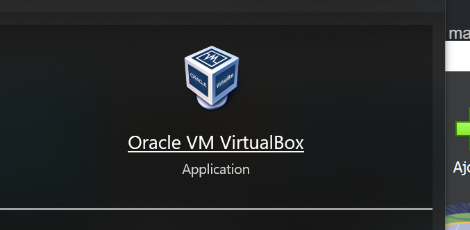

## Étapes de création d'une VM

### 1. Installer VirtualBox

- Téléchargez VirtualBox ici : [https://www.virtualbox.org/](https://www.virtualbox.org/)
- Installez-le comme n'importe quel autre logiciel.

### 2. Télécharger une image ISO

Un fichier **ISO** contient l'installation d'un système d'exploitation. Voici quelques liens pour télécharger des ISO :

- **Ubuntu (Linux)** : [https://ubuntu.com/download/desktop](https://ubuntucinnamon.org)
- **Debian (Linux)** : [https://www.debian.org/CD/http-ftp/#mirrors](https://www.debian.org/CD/http-ftp/#mirrors)
- **Windows 10** : Utilisez l'outil officiel de Microsoft pour télécharger l'ISO.

### 3. Créer une nouvelle VM dans VirtualBox

1. Ouvrez VirtualBox.
2. Cliquez sur le bouton **Nouvelle**.
3. Donnez un nom à la VM et choisissez le type d'OS (Linux, Windows, etc.).
4. Définissez les ressources (RAM, processeur, espace disque).
5. Lorsqu'on vous demande le fichier ISO, sélectionnez celui que vous avez téléchargé.
6. Lancez la VM et suivez les instructions à l'écran pour installer l'OS.

