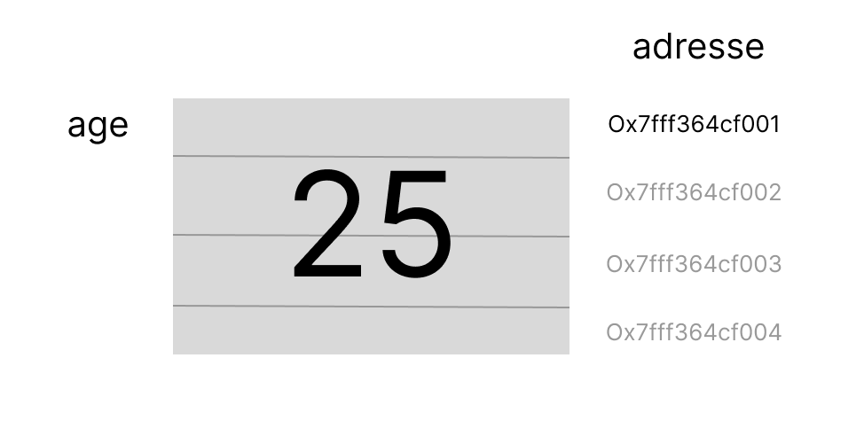

# Pointeur et Tableaux

## Les adresses

Toutes les variables possèdes un nom et une adresse.

Le nom de la variable permet au programmeur de manipuler l'espace mémoire facilement dans le code. Mais en réalité c'est bien l'adresse qui est utilisé par l'ordinateur.


### Connaitre l'adresse d'une variable - L'opérateur de déréférencement `&`

Prenons une variable de type `int` qui contient la valeur 25.

```c
#include <stdio.h>

int main(){
    int age = 25;
    printf("La valeur de age est : %d\n",age);

    return 0;
}
```

Je peux connaitre son adresse avec l'opérateur `&`.

```c
#include <stdio.h>

int main(){
    int age = 25;
    printf("La valeur de age est : %d\n",age); // 25

    printf("L'adresse de age est %d \n",&age); //905648460

    return 0;
}
```

1. Relancez plusieurs fois le programme. Notez que l'adresse de age change à chaque nouvelle execution.

### printf hexadecimal %p
`printf` affiche mal les adresse avec le formatage `%d` on préfère utiliser le formatage hexadecimal `%p`.

```c
#include <stdio.h>

int main(){
    int age = 25;
    printf("La valeur de age est : %d\n",age); // 25

    printf("L'adresse de age est %p \n",&age); // Ox7fff364cf40c

    return 0;
}
```

On peut donc représenter la variable age en mémoire comme ceci :



- `age` est un `int` il prend donc 4 octets en mémoire.
- son adresse est l'adresse du premier espace mémoire (`0x7fff364cf001`).

> Meme si `age` est stockée sur 4 espaces mémoires le compilateur ne travail qu'avec la première adresse. Les autres adresses sont comme gelées et donc inutilisables par une autre variable.

### Segmentation fault

Il est impossible (du moins très difficle) pour le programmeur de prévoir l'adresse d'une variable à l'avance. Car sous Linux le Memory Manager fait l'interface entre la RAM et le code et déclarer vos variables dans un espace appelé segment.

Un segment est l'espace mémoire que reserve le memory manager à votre programme.

Si vous tentez d'accéder à une adresse qui n'est pas dans votre segment vous obtenez une erreur de segmentation ou *segmentation fault*.

#### Exemple scanf

Voici un exemple de code qui utilise scanf pour remplir un espace mémoire par l'entrée clavier d'un utilisateur.

```c
#include <stdio.h>

int main(){
    int age = 0;

    printf("Age ?\n");
    scanf("%d",&age);
    printf("J'ai %d ans !\n");

    return 0;
}
```

**scanf a besoin de remplir un espace mémoire je suis donc obligé d'utiliser `&` pour lui donner l'adresse de la variable à remplir.**

```c
scanf("%d",&age);
```

Je peux provoquer une erreur de segmentation en fournissant à sanf une adresse qui ne m'appartient pas.

```c
#include <stdio.h>

int main(){
    int age = 0;

    printf("Age ?\n");
    scanf("%d",12); // scanf ecrit dans l'adresse 12 !!!!
    printf("J'ai %d ans !\n");

    return 0;
}
```

```bash
Age ?
25
Erreur de segmentation
```

L'adresse 12 est au début de la RAM donc probablement pas du tout dans le segment de votre programme.

J'ai donc une erreur de segmentation.

## Les pointeurs

Un pointeur est une variable qui contient l'adresse d'une autre variable.

En C il existe une syntaxe qui permet de différencier les variables qui contienne des adresses des autres variables.

```c
#include <stdio.h>

int main(){
    int age = 25;
    void* pointeur = &age;
    printf("Valeur de age\t\t%d\n",age);
    printf("Valeur du pointeur\t%p\n\n",pointeur);
    printf("Adresse de age\t\t%p\n",&age);
    printf("Adresse de pointeur\t%p\n",&pointeur);

    return 0;
}
```

Vous pouvez voir que l'adresse de la variable `age` est égale à la valeur du pointeur.

Le pointeur contient donc l'adresse de la variable age.

```bash
Valeur de age           25
Valeur du pointeur      0x7ffc2830430c

Adresse de age          0x7ffc2830430c
Adresse de pointeur     0x7ffc28304300
```

### `void*` le pointeur générique
`void*` est un type de 8 octets qui peut contenir l'adresse de n'importe quel variable.
Habituelement on va préciser le type de la variable pointée pour éviter les erreurs d'inattention.

```c
#include <stdio.h>

int main(){
    int age = 25;
    int* pAge = &age;  // j'utilise int* plutot que void*

    printf("Valeur de age\t\t%d\n",age);
    printf("Valeur du pointeur\t%p\n\n",pointeur);
    printf("Adresse de age\t\t%p\n",&age);
    printf("Adresse de pointeur\t%p\n",&pointeur);

    return 0;
}
```

### Les types pointeurs

Il existent 

|type|taille(octets)|definition|
|-|-|-|
|void*|8|pointeur générique vers un espace mémoire quelconque.
|int*|8|pointeur d'entier vers un espace mémoire de 4octets de type `int`|
|float*|8|pointeur de nombre à virgule vers un espace mémoire de 8 octets de type `float`|
|char*|8|pointeur de caractère ASCII vers un espace mémoire de 1 octet de type `char`. Les chaines de caratères (string) sont des pointeurs `char*`|

## Les tableaux

Un tableau est une variable qui contient plusieurs valeurs. On s'en sert pour regrouper des données de types similaires en une seule variable.

### Déclaration de tableaux

*Ici je crée plusieurs tableaux*
```c
#include <stdio.h>

int main(){
    int notes[10];
    float tailles[6];
    char prenom[5];
    return 0;
}
```

J'ai crée :
- un tableau de 10 `int` soit 40 octets (4 octets*10).
- un tableau de 6 `float` soit 48 octets (8 octets*6).
- un tableau de 5 `char` soit 5 octets.

Je peux me rendre compte de l'espace mémoire alloué avec l'opérateur `sizeof`.

```c
#include <stdio.h>

int main(){
    int notes[10];
    float tailles[6];
    char prenom[5];

    printf("sizeof notes  = %d\n",sizeof notes); // 40
    printf("sizeof prenom  = %d\n",sizeof prenom); // 5
    return 0;
}
```

1. Afficher la taille du tableau `tailles`. Justifier sa taille.

### Lire ou écrire dans un tableau

```c
int tab[3];

tab[0] = 4;
tab[1] = 8;
tab[2] = 7;
```

### Organisation mémoires d'un tableau

Un tableau est un espace mémoire de données de même taille organisé de façon contigue.

Cela signifie surtout deux choses :

- un tableau ne peut contenir qu'un seul types de données à la fois
- les éléments d'un tableau sont organisés les un à la suite des autres.


### Les tableaux sont des pointeurs
