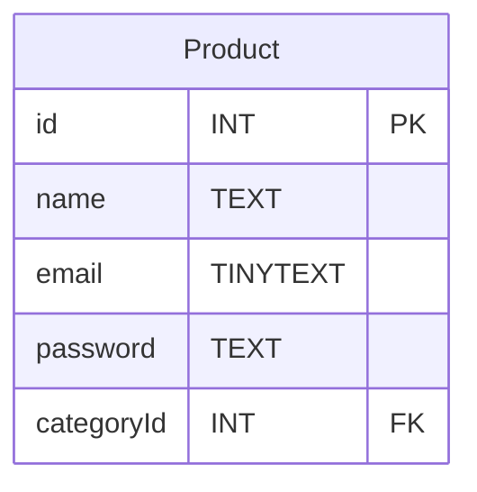

# Model Pattern

Le Pattern Model permet de représenter une table de la persistance de données dans via une structure de données.

La plupart du temps, un modèle est une classe en interface, une structure C Ou même un objet Javascript.

Par exemple, une classe modèle qui représente une Table SQL contiendrait :
- des attributs équivalent aux champs de la table.
- des méthodes CRUD (getter et setter) pour modifier la table.

Parfois, on coupe le modèle en 2 parties, une structure de données qui ne contient que les attributs relatifs au champ de la table. On appelle ça une entity et une autre structure de données qui contient les méthodes qui permettent d'accéder à la table. On appelle ça un modèle. 

Certains framework comme Spring appellent l'entité, le modèle et le modèle le répository historique. L'important c'est de comprendre qu'un modèle représente les données d'une persistance de données. 

<!-- 
Infos à verifier ! Est ce que c'est vraiment ça la différence entre une entity modèle ? Je suis pas, j'ai toujours dit ça, mais je suis pas sûr, faudrait que je vérifie.
 -->

Soit la table SQL suivante :



## Exemple en TypeScript

*product.model.ts*
```ts
export interface Product{
    id : number
    name : string
    email : string
    password : string
    categoryId : number 
}
```

*product.repository.ts*
```ts

import {connection} from "core/database.ts"

export class ProductRepository{
    static getAllProducts() : Promise<Product[]>
    {
        return new Promise((resolve,reject)=>{

            connection.execute("SELECT * FROM Product",(err,products : Products[])=>{
                if(err){
                    reject(err);
                }
                else{
                    resolve(products);
                }
            });
        }
    }

    static getProduct(id:number) : Promise<Product | null>
    {
        return new Promise((resolve,reject)=>{
            // J'utilise une requete préparé pour éviter une injection SQL.
            connection.execute('SELECT * FROM Product WHERE id=?', [id], (err, products) =>{
                if(err){
                    reject(err);
                }
                else{
                    resolve(products);
                }
            });

        });
    }

    static addProduct(newProduct:Product) : Promise<number>
    {
        return new Promise((resolve,reject)=>{
            // J'utilise une requete préparé pour éviter une injection SQL.
            connection.execute('INSERT INTO Product (name,email,password,cateogryId) VALUES (?,?,?,?)', [product.name,product.email,product.password,product.categoryId], (err, results) =>{
                if(err){
                    reject(err);
                }
                else{
                    resolve(results);
                }
            });

        })
    }
}
```


