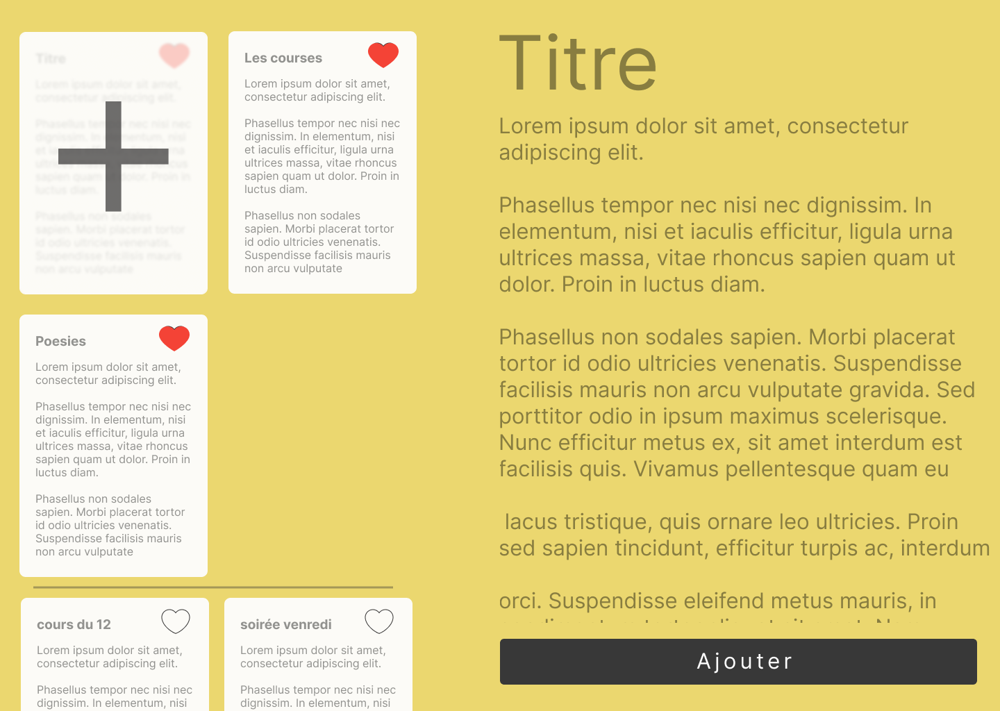

# Note App

## Pré-requis technique
- Savoir faire une API REST de type CRUD pour la persitance des données en back-end.
- Un client HTTP comme fetch, axios, XMLHttpRequest ou HttpClient pour récupérer les données de l'API REST dans le front.
- JavaScript Front-end : un framework front-end ou VanillaJS.

> CRUD : Create Read Update Delete les actions possibles sur le serveur.

> API REST :  Serveur http stateless qui délivre des données en JSON.

> Stateless, Sans etats : Une Api REST est un serveur web sans êtat (stateless). C'est à dire qu'à l'inverse d'un serveur web classique, l'api rest ne retient aucune données lors des requêtes : ni cookies, ni session, rien.

## Description du projet
Un clone de l'application Note disponible sur IOS ou Android.

## Cahier des charges
|Tache|Description|
|-|-|
|L'utilisateur peut consulter ses notes.||
|L'utilisateur peut ajouter, supprimer ou modifier une note||
|L'utilisateut peut `liker` des notes. Les notes likées sont affichées en premières dans la liste des notes.||
|Les notes sont enregistrées dans une BDD SQL en back-end.||

## 1. Rédigier les specifications

1. Use Case Diagram
2. Entity Relation Diagram

<!-- 
## Objectif BONUS
- Demander à l'utilisateur son nom lorsqu'il arrive sur le site et associer les notes à son nom lors de l'ajout.
- Si des noms existent deja il faut les afficher à l'utilisateur à l'arrivée sur le site pour qu'il puissent choisir son nom et voir uniquement ses notes.
> Cet objectif bonus neccéssite une relation entre plusieurs tables. **Effectuer donc un diagramme d'entité relation pour définir cette relation.** -->